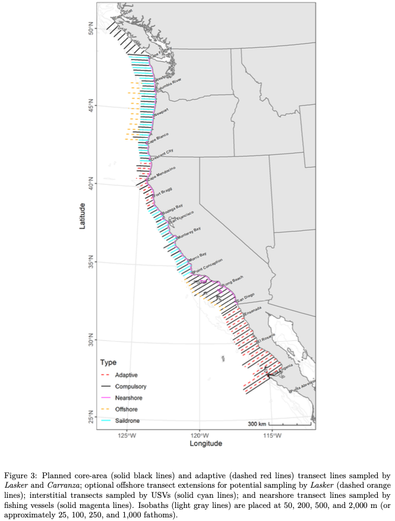

## Survey objectives and background
The objectives of the California Current Ecosystem Survey (CCES), also known as the Coastal Pelagic Species (CPS) Survey, are to:

1. Acoustically map the distributions, measure the species compositions and size-frequency distributions, and estimate the abundances of CPS; 
2. Characterize and investigate linkages to their biotic and abiotic environments;
3. Gather information regarding their life histories; and 
4. Use fishing vessels and USVs to sample in offshore and nearshore areas when and where sampling from NOAA ships was deemed inefficient, unsafe, or both (Fig. 1).

 

### Survey methodology
The CCES uses the Acoustic-Trawl Method (ATM), which combines acoustic sampling to measure backscatter of coastal pelagic species with midwater trawling to identify species composition and length distributions of acoustic targets. 

 

### Spatial and temporal extent

#### Spatial

The survey extent typically ranges from Vancouver Island to the Mexican border, although the exact survey coverage has varied from year to year. 

 

#### Temporal

The SWFSC ATM surveys began in 2006. Surveys have occurred either in the spring (April) or the summer (July-September), with summer surveys occurring in nearly every year since 2008 and spring surveys occurring only in certain years. Surveys typically go north to south, such that the first leg (Cape Flattery, WA to Newport OR), which overlaps with the JSOES survey region, is conducted in July.

 

### Core taxa

- Pacific Sardine *Sardinops sagax*
- Northern Anchovy *Engraulis mordax*
- Pacific Herring *Clupea pallasii*
- Pacific Round Herring *Etrumeus acuminatus*
- Pacific Mackerel *Scomber japonicus*
- Jack Mackerel *Trachurus symmetricus*
- Krill (euphausiid spp.)

 

#### References

