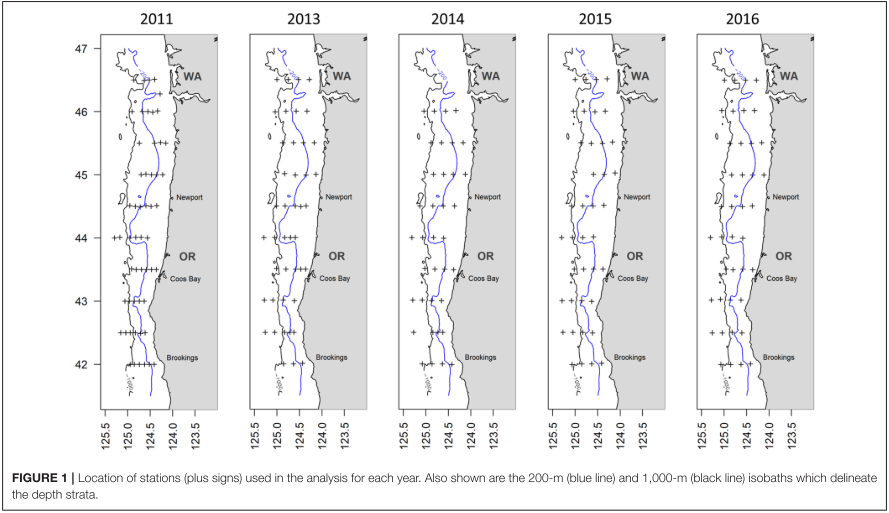
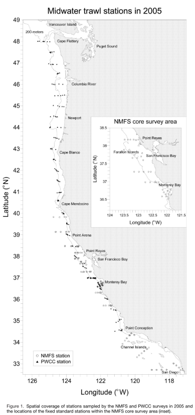

## Survey objectives and background
The objectives of the pre-recruit survey (PRS) are to:

1. Quantify the environmental conditions and organisms of the Northern California Current (off Oregon and Washington);
2. Study ecosystem-level processes affecting managed and protected marine resources

 

### Survey methodology

The PRS survey uses multiple sampling methods:

1. CTD casts at fixed stations measure temperature, salinity, density, chlorophyll a, turbidity, and dissolved oxygen throughout the water column (to maximum depth of 500 m)
2. Underway acoustic data are collected continuously throughout the survey to acoustically characterize the distribution and abundance of macrozooplankton, micronekton, meroplankton, and zooplankton
3. Biological sampling is conducted using a modified Cobb midwater trawl and bongo and Manta nets at fixed cross-shelf stations along ten 0.5◦-latitudinal transects. The midwater trawls have a target headrope depth of 30 m, are ∼15 min in duration, and are conducted at night.
4. Ichthyo- and zooplankton are collected using a bongo net with a 60-cm diameter mouth opening and 333-µm mesh nets.

 

### Spatial and temporal extent

#### Spatial

The pre-recruit survey samples from approximately Brookings, OR to the mouth of the Columbia River.

How do we see the full PWCC extent? The citations provided in Gallo et al. 2022 don't talk about the full survey.

 

#### Temporal

The PRS began in 2001 as a collaboration between NOAA and the Pacific Whiting Conservation Cooperative (PWCC) and helped complement survey effort by the RREAS off California. The PWCC surveys sampled at non-fixed locations centered on the shelf break because of the belief that that was where YOY hake were most likely to occur. The PWCC surveys covered the area from Newport, OR to Point Conception in 2001, 2002, and 2003. In 2004,  the spatial coverage was expanded to just north of the Columbia River, and in 2005, was again expanded to just south of Cape Flattery [@Sakuma2006]. The last year of the PWCC survey was 2009.

Since 2011, the PRS has been operated by the NWFSC and coordinates directly with the RREAS. The area covered by the PRS includes the Oregon and Washington coasts from approximately Brookings, OR to the mouth of the Columbia River.

 

### Core taxa

- Pacifc Sardine *Sardinops sagax*
- Northern Anchovy *Engraulis mordax*
- Pacifc Herring *Clupea pallasii*
- Pacifc Round Herring *Etrumeus acuminatus*
- Pacifc Mackerel *Scomber japonicus*
- Jack Mackerel *Trachurus symmetricus*
- Krill (euphausiid spp.)

