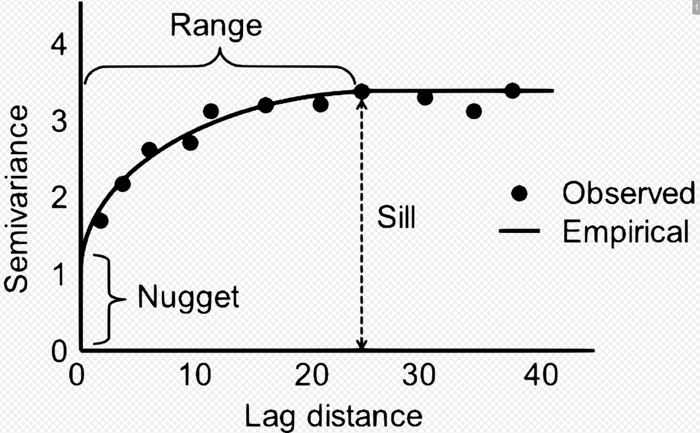

```{r, echo = FALSE, message = FALSE, warning = FALSE}
knitr::opts_chunk$set(echo = FALSE, message = FALSE, warning = FALSE)
```

This page contains exploratory analysis for the Bongo net data from [JSOES](https://markusmin.github.io/JSOES-SDM/jsoes_survey_description.html). Please note that because the Bongo net tows occur during daylight hours, the tow composition is biased towards taxa/life stages that do not vertically migrate.


```{r load_libraries_data}
library(readxl)
library(here)
library(janitor)
library(tidyverse)
library(kableExtra)
library(sf)
library(gstat)
library(sp)
library(ggthemes)
library(ape)


bongo <- clean_names(read_excel(here::here("Data", "Markus_Min_Plankton Density for Trophic Summary Query_10.11.24.xlsx")))
# Drop any samples that don't have spatial data
filter(bongo, !(is.na(dec_long))) -> bongo
# this drops one sample: 062904NH30 (NH30 in June 2004)

# turn this into an sf object
st_as_sf(bongo, coords = c("dec_long", "dec_lat"), crs = 4326) -> bongo_sf

# change CRS to UTM zone 10 (to work in meters)
UTM_zone_10_crs <- 32610
bongo_sf_proj <- sf::st_transform(bongo_sf, crs = UTM_zone_10_crs)

# make this projection into kilometers to help with interpretability
bongo_sf_proj_km <- st_as_sf(bongo_sf_proj$geometry/1000, crs = UTM_zone_10_crs)

# extract geometry
as.data.frame(st_coordinates(bongo_sf_proj_km)) -> bongo_km
# add this back to bongo (X and Y now represent eastings and northings in km)
bind_cols(bongo, bongo_km) -> bongo

trophic_groupings <- clean_names(read_excel(here::here("Data", "Markus_Min_Trophic Groupings_10.2.24.xlsx")))

# change genus species to be consistent across these two files, and usual 
# latin name and common name capitalization
bongo$genus_species <- str_to_sentence(bongo$genus_species)
trophic_groupings$genus_species <- str_to_sentence(trophic_groupings$genus_species)
trophic_groupings$common_name <- str_to_title(trophic_groupings$common_name)

trophic_groupings %>% 
  dplyr::select(genus_species, common_name) %>% 
  filter(!(duplicated(genus_species))) -> common_name_df

# get all unique tows
bongo %>% 
  mutate(sampleID = paste0(station, "_", sample_date)) %>% 
  relocate(sampleID) %>% 
  dplyr::select(-c(genus_species, life_history_stage, id_code, count, sum_of_density_number_m3)) %>% 
  filter(!(duplicated(sampleID))) -> bongo_tows

# complete bongo data, so that we have zeros for each taxon in tows where they weren't caught
bongo %>% 
  mutate(sampleID = paste0(station, "_", sample_date)) %>% 
  relocate(sampleID) %>% 
  # drop tow information; we will add this back later
  dplyr::select(-c(id_code, cruise_number, month, year, station_code, net_type, sample_date,
           sample_time, dec_lat, dec_long, station_depth_m, transect_name, station_number, 
           station, n_cr_s, day_night, volume_filtered_m3)) %>% 
  complete(sampleID, 
           nesting(genus_species, life_history_stage), 
           fill = list(count = 0, sum_of_density_number_m3 = 0)) -> bongo_catch

bongo_catch %>% 
  left_join(bongo_tows, by = "sampleID") -> bongo_catch


# add common name
bongo_catch %>% left_join(common_name_df, by = "genus_species") -> bongo_catch

# create a version of this where we collapse all life history stages together
bongo_catch %>% 
  dplyr::select(sampleID, genus_species, count, sum_of_density_number_m3) %>% 
  group_by(sampleID, genus_species) %>% 
  summarise_if(is.numeric, sum) -> bongo_catch_LH_collapse

bongo_catch_LH_collapse %>% 
  left_join(bongo_tows, by = "sampleID") %>% 
  ungroup() -> bongo_catch_LH_collapse
```

```{r load_spatial_data}
#### Spatial data ####
usa_spdf <- st_read("/Users/markusmin/Documents/ESA_RF_2021/map_files/USA_adm0.shp", quiet = TRUE)
# load BC
CAN_spdf <- st_read("/Users/markusmin/Documents/ESA_RF_2021/map_files/canada/lpr_000b16a_e.shp", quiet = TRUE)
BC_spdf <- filter(CAN_spdf, PRENAME == "British Columbia")
BC_proj <- st_transform(BC_spdf, crs = 4326)


# crop them to our desired area
US_west_coast <- sf::st_crop(usa_spdf,
    c(xmin = -126, ymin = 44, xmax = -123, ymax = 48.5))

BC_coast <- sf::st_crop(BC_proj,
    c(xmin = -126, ymin = 44, xmax = -123, ymax = 48.5))


# convert both shapefiles to a different projection (UTM zone 10) so that they can be plotted with the sdmTMB output
UTM_zone_10_crs <- 32610

US_west_coast_proj <- sf::st_transform(US_west_coast, crs = UTM_zone_10_crs)
BC_coast_proj <- sf::st_transform(BC_coast, crs = UTM_zone_10_crs)

# make this projection into kilometers
US_west_coast_proj_km <- st_as_sf(US_west_coast_proj$geometry/1000, crs = UTM_zone_10_crs)
BC_coast_proj_km <- st_as_sf(BC_coast_proj$geometry/1000, crs = UTM_zone_10_crs)
```


```{r common_taxa}
## total density
bongo_catch %>% 
  group_by(genus_species) %>% 
  summarise(mean_density_per_m3 = mean(sum_of_density_number_m3),
            sd_density_per_m3 = sd(sum_of_density_number_m3)) %>% 
  arrange(desc(mean_density_per_m3)) %>% 
  left_join(common_name_df, by = "genus_species") %>% 
  relocate(common_name, .after = "genus_species") -> bongo_catch_density_sums

bongo_catch_density_sums[1:10,] %>% 
  mutate(mean_density_per_m3 = round(mean_density_per_m3, 1),
         sd_density_per_m3 = round(sd_density_per_m3, 1)) %>% 
  kbl(caption = "Top ten taxa by mean density.") %>% 
  kable_styling(latex_options = "HOLD_position")

## frequency of occurrence

# get count of each genus_species
bongo_catch_LH_collapse %>% 
  filter(sum_of_density_number_m3 > 0) %>% 
  count(genus_species) %>% 
  arrange(desc(n)) %>% 
  mutate(prop_samples = n/nrow(bongo_tows)) %>% 
  left_join(common_name_df, by = "genus_species") %>% 
  relocate(common_name, .after = "genus_species") -> bongo_freq_occ

bongo_freq_occ[1:10, c("genus_species", "common_name", "prop_samples")] %>% 
  mutate(prop_samples = round(prop_samples, 2)) %>% 
  kbl(caption = "Top ten taxa by frequency of occurrence.") %>% 
  kable_styling(latex_options = "HOLD_position")

```


```{r create_basemap}
# create base map
survey_area_basemap_km <- ggplot(US_west_coast_proj_km) +
  geom_sf() +
  geom_sf(data = BC_coast_proj_km) +
  # coord_sf(ylim = c(4922.052, 5342.052), xlim = c(334.8638, 404.8638)) +
  # coord_sf(ylim = c(44,48.5),  xlim = c(-126, -123)) +
  ylab("Latitude")+
  xlab("Longitude")+
  theme(plot.background = element_rect(fill = "white"),
        panel.background = element_rect(fill="white", color = "black"),
        panel.border = element_rect(colour = "black", fill=NA, size=1),
        panel.grid.major = element_blank(),
        panel.grid.minor = element_blank(),
        legend.position = c(0.14, 0.2),
        legend.title = element_text(size = 14),
        legend.text = element_text(size = 12),
        axis.ticks = element_blank(),
        axis.text = element_blank())
  # temporary fix for lat/long on axes to just get rid of them - start here to actually fix: https://forum.posit.co/t/converting-axes-to-lat-lon/27181

survey_area_basemap <- ggplot(US_west_coast) +
  geom_sf() +
  geom_sf(data = BC_coast) +
  coord_sf(ylim = c(44,48.5),  xlim = c(-126, -123)) +
  scale_x_continuous(breaks = c(124,125,126)) +
  ylab("Latitude")+
  xlab("Longitude")+
  theme(plot.background = element_rect(fill = "white"),
        panel.background = element_rect(fill="white", color = "black"),
        panel.border = element_rect(colour = "black", fill=NA, size=1),
        panel.grid.major = element_blank(),
        panel.grid.minor = element_blank(),
        legend.position = c(0.14, 0.2),
        legend.title = element_text(size = 14),
        legend.text = element_text(size = 12))
```


```{r plot-taxon-distribution}
plot_distribution <- function(data, taxon_name){
  # create facet_wrap plot for distribution across all years
  data %>% 
    mutate(encounter = ifelse(sum_of_density_number_m3 == 0, "zero", "non-zero")) %>% 
    dplyr::rename("density (N/m3)" = sum_of_density_number_m3) -> data
  
  survey_area_basemap +
      geom_point(data = data, aes(x = dec_long, y = dec_lat, size = `density (N/m3)`, color = encounter),
                 alpha = 0.5) +
    scale_color_manual(values = c("zero" = "#fc9272", "non-zero" = "#2ca25f")) +
    facet_wrap(~year, nrow = 3) +
    ggtitle(taxon_name) +
    theme(legend.position = c(0.9, 0.15),
        legend.key.height = unit(0.35, "cm"),
        legend.key.width = unit(0.25, "cm"),
        legend.title = element_text(size = 8),
        legend.text = element_text(size = 6),
        legend.spacing.y = unit(0.01, 'cm')) -> species_distribution_plot
  
  return(species_distribution_plot)
}
```
## Annual time series

This Shiny app can be used to explore the abundances of different taxa across the full length of the time series.

<iframe src="https://markusmin.shinyapps.io/jsoes_bongo_annual_time_series/" style="border:none;width:1000px;height:500px;"></iframe>

To demonstrate potential analyses that could be applied to different taxa, we will focus for now on copepods. In the JSOES Bongo data *Calanus marshallae* is the most abundant cold-water copepod and *Calanus pacificus* is the most abundant warm-water coepod. To demonstrate how we can visualize the abundance of these two key copepod species in space and time, we plot their density in survey catch below.

```{r map_calanus}
cama_dist_plot <- plot_distribution(data = subset(bongo_catch_LH_collapse, genus_species == "Calanus marshallae"),
                                    taxon_name = "Calanus marshallae")


ggsave(here::here("docs", "figures", "jsoes_bongo_exploratory", "cama_dist_plot.png"), plot = cama_dist_plot, height = 12, width = 17)


capa_dist_plot <- plot_distribution(data = subset(bongo_catch_LH_collapse, genus_species == "Calanus pacificus"),
                                    taxon_name = "Calanus pacificus")


ggsave(here::here("docs", "figures", "jsoes_bongo_exploratory", "capa_dist_plot.png"), plot = capa_dist_plot, height = 12, width = 17)

# print maps for website
cama_dist_plot
capa_dist_plot

```

By taking the mean log density across the survey region, we can also create a crude index of abundance.

```{r calanus_time_series}
create_time_series <- function(data, taxon){
  data %>% 
    mutate(log_density = log(sum_of_density_number_m3 + 1)) %>% 
    group_by(year) %>% 
    summarise(mean_density = mean(log_density),
              sd_density = sd(log_density)) %>% 
    # mutate(CI_95_upper = mean_density + 1.96*sd_density) %>% 
    # mutate(CI_95_lower = mean_density - 1.96*sd_density) %>% 
    mutate(taxon = taxon) -> ts
  
  return(ts)
}

create_time_series(data = subset(bongo_catch_LH_collapse, genus_species == "Calanus marshallae"),
                                 taxon = "Calanus marshallae") -> cama_ts
create_time_series(data = subset(bongo_catch_LH_collapse, genus_species == "Calanus pacificus"),
                   taxon = "Calanus pacificus") -> capa_ts

cama_ts %>% 
  bind_rows(., capa_ts) -> calanus_ts

ggplot(calanus_ts, aes(x = year, y = mean_density, color = taxon)) +
  geom_point() +
  geom_line() +
  ylab("Mean log (density/m3 + 1)") +
  scale_color_manual(values = c("Calanus marshallae" = "#67a9cf", "Calanus pacificus" = "#b2182b"))


```

<br>

From the maps and the indices of abundance, we see that *Calanus marshallae* is usually more abundant than *Calanus pacificus*, except in warm years (e.g., 2015-2017, which aligns with the Blob).

## Temporal and Spatial Autocorrelation

Before fitting any spatiotemporal models, we must explore the spatial and temporal autocorrelation in the data.

```{r create_station_grid}
# Determine the distance between different stations
# NH30 was apparently only sampled on 2004-06-29; so ignore that one. It's also
# the only station with missing lat/lon info
bongo_tows %>% 
  filter(!(is.na(dec_lat))) %>% 
  filter(!(duplicated(station))) %>% 
  dplyr::select(dec_lat, dec_long, station_depth_m, transect_name, transect_name,
                station_number, station) %>% 
  relocate(station, transect_name, station_number) -> bongo_stations

# convert to sf object
st_as_sf(bongo_stations, coords = c("dec_long", "dec_lat"), crs = 4326) -> bongo_stations_sf

as.data.frame(st_distance(bongo_stations_sf)) -> bongo_stations_distance_matrix
colnames(bongo_stations_distance_matrix) <- bongo_stations$station
rownames(bongo_stations_distance_matrix) <- bongo_stations$station
```

<br>

### Temporal structure

We can first inspect the autocorrelation in our *Calanus marshallae* and *Calanus pacificus* mean annual time series.

```{r coastwide_temporal_autocorrelation}
# It would make sense to try different spatial structures and then test autocorrelation.
# 1) Coastwide; 2) By transect; 3) By station

acf(cama_ts$mean_density, main = "Calanus marshallae, mean log density")
acf(capa_ts$mean_density, main = "Calanus pacificus, mean log density")
```

At the coastwide scale the *Calanus marshallae* time series does not show temporal autocorrelation, but the *Calanus pacificus* time series does at a lag of one year.

We can also inspect temporal autocorrelation at the scale of individual stations. To reduce the number of individual ACF plots, I have instead plotted histograms showing the distribution of lag 1 autocorrelation across stations for each of our two focal copepod species, along with time series plots for the stations that had significant autocorrelation at this lag:

```{r by_station_temporal_autocorrelation_functions}
as.data.frame(table(bongo_tows$station)) %>% 
  filter(Freq >= 10) %>% 
  dplyr::rename(station = Var1) -> annual_stations

station_subset <- annual_stations$station

lag1_AC_station <- function(data, taxon, station_name){
  data %>% 
    filter(station == station_name,
           genus_species == taxon) %>% 
    dplyr::select(genus_species, sum_of_density_number_m3, year, station) %>% 
    mutate(log_density = log(sum_of_density_number_m3 + 1)) -> data_subset
  
  # if we're missing years, fill them in with NAs
  data_subset %>% 
    complete(., year = 1999:2023, fill = list(genus_species = taxon, 
                                              sum_of_density_number_m3 = NA,
                                              log_density = NA,
                                              station = station_name)) -> data_subset
  
  acf_obj <- acf(data_subset$log_density, na.action = na.pass,
                 plot = FALSE)
  nn <- acf_obj$n.used
  upper_95_CI <- -1/nn + 2/sqrt(nn)
  
  lag1_autocorrelation <- acf_obj$acf[2,1,1]
  
  sig <- ifelse(lag1_autocorrelation > upper_95_CI, "yes", "no")
  
  station_lag1_ac <- data.frame(station = station_name, lag1_ac = lag1_autocorrelation, 
                                taxon = taxon, significant = sig)
  
  return(station_lag1_ac)
}

plot_station_ts <- function(data, taxon, station_name){
  data %>% 
    filter(station == station_name,
           genus_species == taxon) %>%
    mutate(log_density = log(sum_of_density_number_m3 + 1)) %>% 
    dplyr::select(genus_species, log_density, year, station) -> data_subset
  
  # if we're missing years, fill them in with NAs
  data_subset %>% 
    complete(., year = 1999:2023, fill = list(genus_species = taxon, 
                                              sum_of_density_number_m3 = NA,
                                              log_density = NA,
                                              station = station_name)) -> data_subset
  
  plot <- ggplot(data_subset, aes(x = year, y = log_density, color = genus_species)) +
    geom_point() +
    geom_line() +
    ylab("log density + 1 (N/m3)") +
    ggtitle(station_name) +
    scale_color_manual(values = c("Calanus marshallae" = "#67a9cf", "Calanus pacificus" = "#b2182b"))
  
  print(plot)
  return(plot)
}
```  

```{r by_station_temporal_autocorrelation_calanus}
# Calanus marshallae
cama_lag1_AC <-  lag1_AC_station(data = bongo_catch_LH_collapse,
                           taxon = "Calanus marshallae",
                           station_name = station_subset[1])

for (i in 2:length(station_subset)) {
  
  station_lag1_AC <- lag1_AC_station(data = bongo_catch_LH_collapse,
                           taxon = "Calanus marshallae",
                           station_name = station_subset[i])
  
  cama_lag1_AC %>% 
    bind_rows(., station_lag1_AC) -> cama_lag1_AC
  
}

ggplot(cama_lag1_AC, aes(x = lag1_ac, fill = significant))+
  geom_histogram() + 
  ggtitle("Calanus marshallae Lag 1 autocorrelation")+
  xlab("Lag 1 autocorrelation")

# Plot the time series for the one station with significant lag 1 autocorrelation (LP06)
cama_sig_stations <- subset(bongo_catch_LH_collapse, genus_species == "Calanus marshallae" &
         station %in% subset(cama_lag1_AC, significant == "yes")$station)

ggplot(cama_sig_stations, aes(x = year, y = sum_of_density_number_m3, color = station)) +
    geom_point() +
    geom_line() +
    ylab("density (N/m3)") +
    ggtitle("Calanus marshallae, stations with significant lag 1 autocorrelation") +
    scale_color_tableau(palette = "Tableau 10")

# Calanus pacificus
capa_lag1_AC <-  lag1_AC_station(data = bongo_catch_LH_collapse,
                           taxon = "Calanus pacificus",
                           station_name = station_subset[1])

for (i in 2:length(station_subset)) {
  
  station_lag1_AC <- lag1_AC_station(data = bongo_catch_LH_collapse,
                           taxon = "Calanus pacificus",
                           station_name = station_subset[i])
  
  capa_lag1_AC %>% 
    bind_rows(., station_lag1_AC) -> capa_lag1_AC
  
}


ggplot(capa_lag1_AC, aes(x = lag1_ac, fill = significant))+
  geom_histogram() + 
  ggtitle("Calanus pacificus Lag 1 autocorrelation")+
  xlab("Lag 1 autocorrelation")

capa_sig_stations <- subset(bongo_catch_LH_collapse, genus_species == "Calanus pacificus" &
         station %in% subset(capa_lag1_AC, significant == "yes")$station)

ggplot(capa_sig_stations, aes(x = year, y = sum_of_density_number_m3, color = station)) +
    geom_point() +
    geom_line() +
    ylab("density (N/m3)") +
    ggtitle("Calanus pacificus, stations with significant lag 1 autocorrelation") +
    scale_color_tableau(palette = "Tableau 10")

```

There is higher temporal autocorrelation at the scale of individual stations for *Calanus pacificus*, which aligns with our coastwide results. Given the relatively short generation times of these copepods, we might expect that the temporal autocorrelation of copepod abundance is driven by the persistence of oceanographic conditions, such as the consecutive years of high abundance during the Blob.

<br>

### Spatial structure

To investigate spatial autocorrelation, we will calculate two metrics: Semivariance and Moran's I. Moran's I is a measure of the overall clustering of the spatial data and tests if there is support to reject the null hypothesis of no spatial structure. Semivariance, visualized using a semivariogram, allows us to examine how spatial autocorrelation decays with increasing distance. In a semivariogram, high spatial autocorrelation appears as as a clear slope that then reaches a plateau at the distance at which there is no spatial autocorrelation, as seen in this image from Wikipedia:

{width=50%}


<br>

To calculate the semivariance, we compute the variance of the difference between values (in our case, the log density) for different distances between samples. It is given by the following formula:

$$
    \gamma(h) = \frac{1}{2} \mathrm{Var}( \log(x_i) - \log(x_{i+h}) )
$$
Where $h$ is the distance between two points, $x_i$ is the value of the log density at one location and $x_{i+h}$ is value of the log density at a location $h$ distance away. Multiplying by $\frac{1}{2}$ accounts for the fact that the formula accounts for the variance arising at both points.

From the semivariance, we can then construct a semivariogram, which depicts the spatial autocorrelation of samples. A semivariogram takes the semivariance calculated for each pair of points and summarizes it by taking the mean value across each bin.

Given that we did not see much evidence for temporal autocorrelation, we will examine the evidence for spatial autocorrelation on a year by year basis. As such, we will construct a separate semivariogram and calculate Moran's I separately for each year. To summarize the Moran's I results, we show the p-value for Moran's I for each year, with the blue dashed line showing a p-value of 0.05.

```{r spatial_autocorrelation_functions}
# If you wanted to add a best fit line:
# A best fit line is then plotted through the points.
# For each year, we will plot the best fit semivariogram model, which we selected from a set of five candidate functional response shapes: 1) Exponential, 2) Spherical, 3) Gaussian, 4) Linear, and 5) Nugget only (y-intercept only).


# Set the models to test
# To see the shape of these models, run `show.vgms()`
model.choices <- vgm(model = c("Nug", "Exp", "Sph", "Gau", "Lin"))

# Function to plot the best fit variogram for a species in a year
# We are going to use 200 km as our cutoff: That should more or less encompass 
# stations that are one transect apart from each other (transects are separated
# by a little less than one degree latitude, which is about 110 km),
# and the extra is to include stations that are on neighboring transects
# but on opposite ends of the transect
# We will bin by every 10 km; this should get neighboring stations but not 
# stations that are two stations away
fit_variogram_one_year <- function(data, taxon, select_year){
  data_subset <- subset(data, genus_species == taxon & year == select_year)
  coordinates(data_subset) = ~X+Y
  
  # Fit isotropic variogram
  iso_v <- variogram(log(sum_of_density_number_m3+1)~1, data = data_subset, cloud=F,
                     cutoff = 200, width = 10)
  model.choices <- vgm(model = c("Nug", "Exp", "Sph", "Gau", "Lin"))
  # variogram_bestfit <- fit.variogram(iso_v, model.choices)
  
  # plot(iso_v, pl=F, model=variogram_bestfit,col="black", cex=1, lwd=0.5,lty=1,pch=20,
  #    main = paste(select_year), xlab="Distance (km)",ylab="Semivariance",
  #    xaxt = "n",
  #    xlim = c(-5, 205))
    plot(iso_v, pl=F,col="black", cex=1, lwd=0.5,lty=1,pch=20,
     main = paste(select_year), xlab="Distance (km)",ylab="Semivariance",
     xaxt = "n",
     xlim = c(-5, 205))
}

# compute Moran's I in any given year
calculate_moranI_one_year <- function(data, taxon, select_year){
  # function based on code from here: https://stats.oarc.ucla.edu/r/faq/how-can-i-calculate-morans-i-in-r/
  
  # subset data
  data_subset <- subset(data, genus_species == taxon & year == select_year)
  
  # get distances between samples
  sample.dists <- as.matrix(dist(cbind(data_subset$X, data_subset$Y)))
  
  # get inverse of matrix values and replace diagonals with zero
  sample.dists.inv <- 1/sample.dists
  diag(sample.dists.inv) <- 0
  
  # calculate Moran's I for the log density
  moran_results <- Moran.I(log(data_subset$sum_of_density_number_m3+1), sample.dists.inv)
  
  return(moran_results$p.value)
}

```


We will first examine spatial autocorrelation in *Calanus marshallae*:

```{r spatial_autocorrelation_cama, fig.show = "hold", out.width = "25%"}
### Calanus marshallae
# Figure out what years have any catch of this taxon
bongo_catch_LH_collapse %>% 
  filter(genus_species == "Calanus marshallae") %>% 
  group_by(year) %>% 
  summarise(year_total = sum(sum_of_density_number_m3)) %>% 
  filter(year_total > 0) %>% 
  arrange(year) -> cama_year_counts

for (i in 1:length(cama_year_counts$year)){
  print(fit_variogram_one_year(data = bongo_catch_LH_collapse, 
                         taxon = "Calanus marshallae",
                         select_year = cama_year_counts$year[i]))
}
```

```{r spatial_autocorrelation_cama_moran_I}
# Calculate Moran's I for each
moran_I_p_values_cama <- data.frame(year = cama_year_counts$year,
  p_value = rep(NA, length(cama_year_counts$year)))

for (i in 1:length(cama_year_counts$year)){
  moran_I_p_values_cama$p_value[i] <- calculate_moranI_one_year(data = bongo_catch_LH_collapse, 
                         taxon = "Calanus marshallae",
                         select_year = cama_year_counts$year[i])
    
}
plot(x = moran_I_p_values_cama$year, y = moran_I_p_values_cama$p_value,
     xlab = "Year", ylab = "Moran's I p-value", main = "Calanus marshallae Moran's I")
abline(a = 0.05, b = 0, lty = 2, col = "blue")
```

<br>


<br>

We will next examine spatial autocorrelation in *Calanus pacificus*:

```{r spatial_autocorrelation_capa, fig.show = "hold", out.width = "25%"}
### Calanus pacificus
# Figure out what years have any catch of this taxon
bongo_catch_LH_collapse %>% 
  filter(genus_species == "Calanus pacificus") %>% 
  group_by(year) %>% 
  summarise(year_total = sum(sum_of_density_number_m3)) %>% 
  filter(year_total > 0) %>% 
  arrange(year) -> capa_year_counts

for (i in 1:length(capa_year_counts$year)){
  print(fit_variogram_one_year(data = bongo_catch_LH_collapse, 
                         taxon = "Calanus pacificus",
                         select_year = capa_year_counts$year[i]))
}
```

```{r spatial_autocorrelation_capa_moran_I}
# Calculate Moran's I for each
moran_I_p_values_capa <- data.frame(year = capa_year_counts$year,
  p_value = rep(NA, length(capa_year_counts$year)))

for (i in 1:length(capa_year_counts$year)){
  moran_I_p_values_capa$p_value[i] <- calculate_moranI_one_year(data = bongo_catch_LH_collapse, 
                         taxon = "Calanus pacificus",
                         select_year = capa_year_counts$year[i])
    
}

plot(x = moran_I_p_values_capa$year, y = moran_I_p_values_capa$p_value,
     xlab = "Year", ylab = "Moran's I p-value", main = "Calanus pacificus Moran's I")
abline(a = 0.05, b = 0, lty = 2, col = "blue")
```

Based on the Moran's I results, we see that there is evidence for spatial clustering in some years but not others. However, there is not a clear slope to the semivariogram, which indicates that there is not evidence for spatial autocorrelation at our sampling resolution. The spread of the points also indicates that our data is quite noisy. These exploratory results suggest that copepods are quite patchy, with these patches occurring on a scale less than the scale of the sampling resolution (which is 5 nm along a single transect orthogonal to the coast).


```{r eval = FALSE}
# code is unused but I'm too scared to delete it

## CAMA, 2011
cama_2011 <- subset(bongo_catch_LH_collapse, genus_species == "Calanus marshallae" & year == 2011)
coordinates(cama_2011) = ~dec_long+dec_lat

# Isotropic variogram
cama_2011_iso_v <- variogram(log(sum_of_density_number_m3+1)~1, data = cama_2011, cloud=F)
# Fit a variogram model
cama_2011_bestfit <- fit.variogram(cama_2011_iso_v, model.choices)

plot(cama_2011_iso_v, pl=F, model=cama_2011_bestfit,col="black", cex=1, lwd=0.5,lty=1,pch=20,
     main="Variogram: Calanus marshallae, 2011",xlab="Distance (km)",ylab="Semivariance")

# Unused plots
# plot(cama_2011_iso_v, main = "Variogram - default", xlab = "Separation distance (m)")
# cama_2011_v.cloud <- variogram(log(sum_of_density_number_m3+1)~1, cama_2011, cloud = T)
# plot(cama_2011_v.cloud, main = "Variogram cloud", xlab = "Separation distance (m)")
# 
# # Anisotropic variogram
# cama_2011_v.map<-variogram(log(sum_of_density_number_m3+1)~1, cama_2011, map = TRUE,
#                            cutoff = 1, width = 1/17)
# 
# plot(cama_2011_v.map, col.regions = bpy.colors(64),
#      main="Variogram Map",
#      xlab="x",
#      ylab="y")


## CAMA, 2005
cama_2005 <- subset(bongo_catch_LH_collapse, genus_species == "Calanus marshallae" & year == 2005)
coordinates(cama_2005) = ~dec_long+dec_lat

# Isotropic variogram
cama_2005_iso_v <- variogram(log(sum_of_density_number_m3+1)~1, data = cama_2005, cloud=F)
# Fit a variogram model
cama_2005_bestfit <- fit.variogram(cama_2005_iso_v, model.choices)

plot(cama_2005_iso_v, pl=F, model=cama_2005_bestfit,col="black", cex=1, lwd=0.5,lty=1,pch=20,
     main="Variogram: Calanus marshallae, 2005",xlab="Distance (km)",ylab="Semivariance")
```