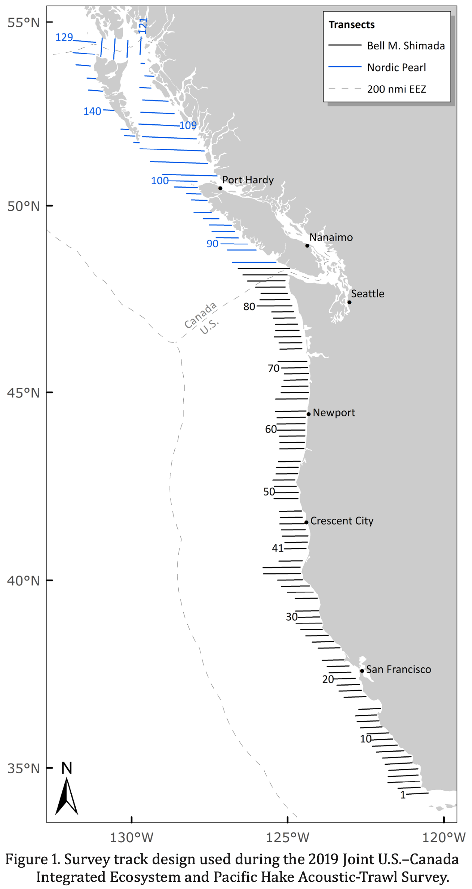

## Survey objectives and background
The primary objective of the Joint U.S.-Canada Integrated Ecosystem and Pacific Hake Acoustic Trawl Survey (Hake Survey) is to provide data to inform the Pacific Hake (*Merluccius productus*) stock assessment. However, the survey also collects environmental and oceanographic information and provides data on krill abundance and distribution.

 

### Survey methodology

The hake survey conducts transects perpendicular to the coast. On each transect, acoustic sampling is conducted continuously at different frequencies. Regions of hake-like backscatter are sampled during the day using a midwater trawl, which allows for species identification of acoustic backscatter, as well as lengths, weights, age, sex, and maturity data for target species. From the paired acoustic and trawl data, hake biomass is estimated. Zooplankton tows with a Methot net are also conducted at certain stations, which is used to verify the identity of acoustic targets suspected to be euphausiids and/or lanternfish. CTD profiles are also collected at selected stations along transects.

 

### Spatial and temporal extent

The hake survey, in its current form, has been conducted jointly between NWFSC and DFO since 2003. The survey is biennial, occurring in odd years (plus 2012). The survey takes place in the summer (June-September), and samples north to south (from Point conception to SE Alaska). In a typical year, the transects off the coasts of Oregon and Washington are sampled in August. Prior to 2003, a triennial survey was conducted by the AFSC (since 1977 in U.S. waters) and DFO (since 1990 in Canadian waters).

 

### Core taxa
- Hake
- Euphausiids
- Shelf-associated rockfishes

#### References
