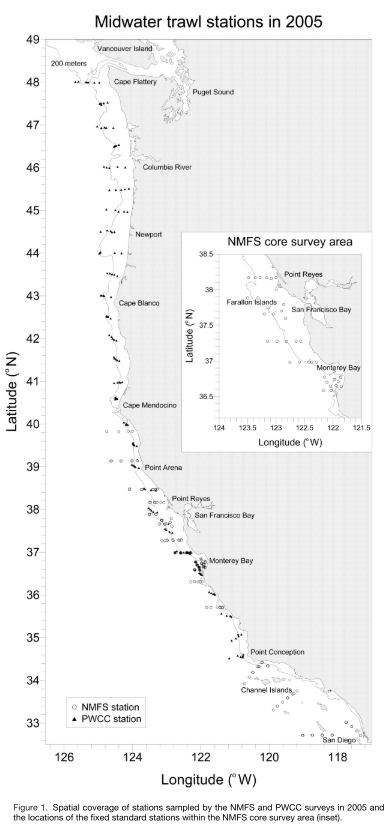

## Survey objectives and background
The objectives of the Joint U.S.-Canada Integrated Ecosystem and Pacific Hake Acoustic Trawl Survey (Hake Survey) are to:

 

### Survey methodology

 

### Spatial and temporal extent

 

### Core taxa

