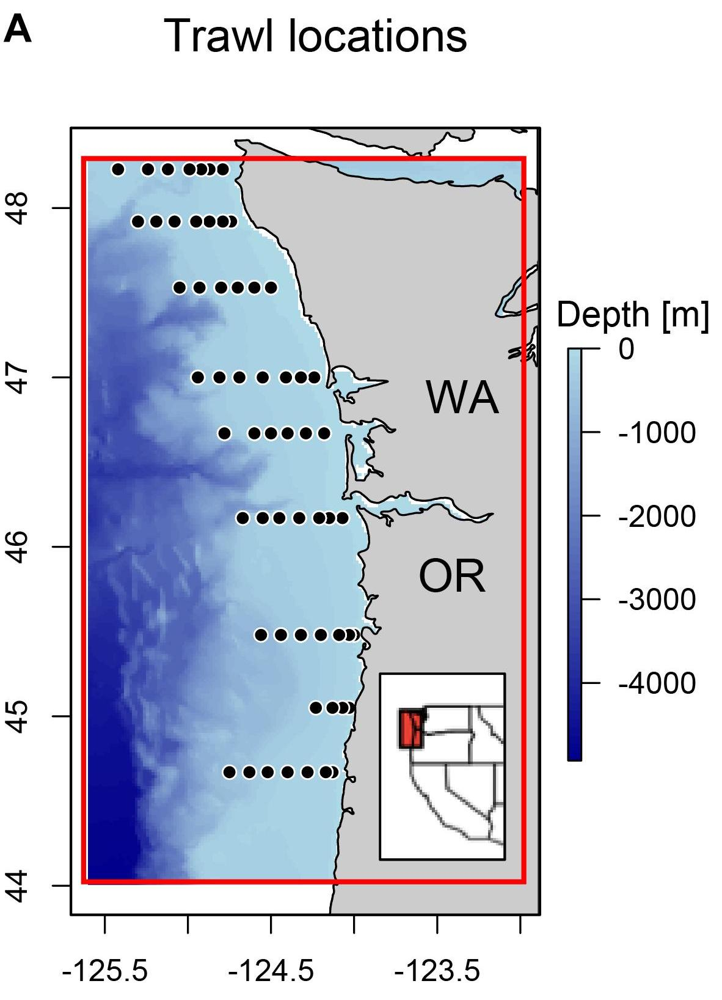

## Survey objectives and background
The objectives of the Juvenile Salmon & Ocean Ecosystem Survey (JSOES) include:

1. identifying shifts in the abundance, distribution, and growth/condition of migrating juvenile salmon
2. Characterizing the ocean ecosystem by sampling physical and biological data

 

### Survey methodology

From @Morgan2019:

> At each station, we sampled temperature, chlorophyll-a concentration, zooplankton, and nekton. Temperature was measured with a conductivity–temperature–depth instrument to within 5 m of the bottom or a depth of 200 m, and chlorophyll-a samples were collected at a depth of 3 m using a Niskin bottle... Zooplankton collections were made with either a 1.0-m-diameter ring net (1999–2000) or a 0.6-m-diameter bongo net (2001–2016), both of which were fitted with 335- μm mesh and a General Oceanics flowmeter to estimate the water volume filtered. Plankton nets were fished by letting out 60 m of cable and immediately retrieved at 30 m/min while being towed at 3.704 km/h (2 knots). The maximum depth fished was 20–30 m... Fish and invertebrate nekton were sampled during the day using a Nordic 264 rope trawl (Nor’Eastern Trawl Systems, Bainbridge Island, Washington) towed to sample the upper 20 m of the water column for 15–30 min at approximately 6.5 km/h.

 

### Spatial and temporal extent

The JSOES survey occurs off the coasts of Oregon and Washington, with transects conducted perpendicularly to the coast. JSOES surveys are conducted every year in June. The JSOES survey is also conducted intermittently in May, and from 1998-2012, the JSOES survey was also conducted in September.

 

### Core taxa

The two different sampling methods (Bongo nets for zooplankton and a Nordic 264 rope trawl for fish and invertebrate nekton) employed by JSOES catch different characteristic taxa.

Bongo:

- Euphausiids
- Copepods
- Various invertebrate larvae (e.g., barnacles and *Cancer*)

Trawl:

- Subadult, yearling, and subyearling salmon (primarily Chinook and Coho)
- Coastal pelagic species, such as Pacific sardine, Northern Anchovy, American Shad, various smelts, Jack Mackerel, and Pacific Herring
- Gelatinous zooplankton, like water jellies

