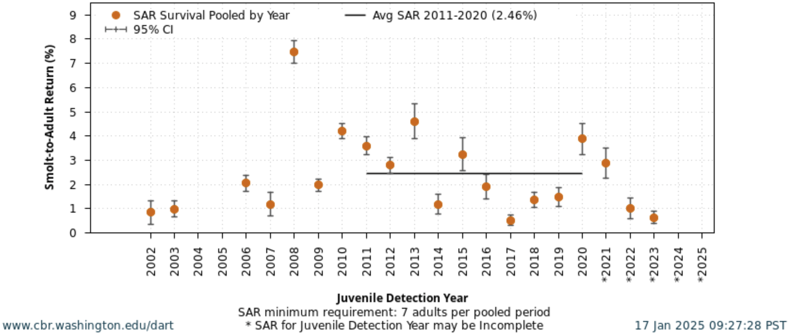
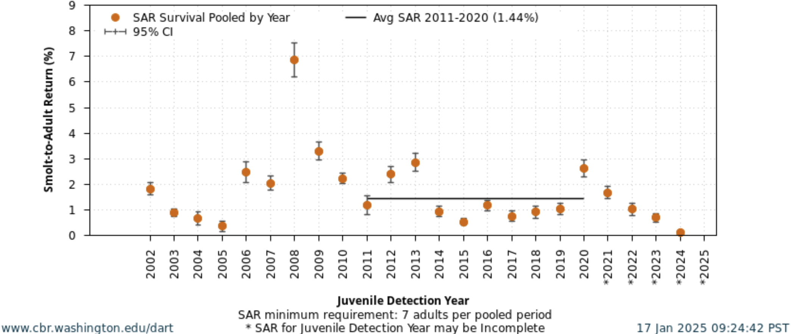
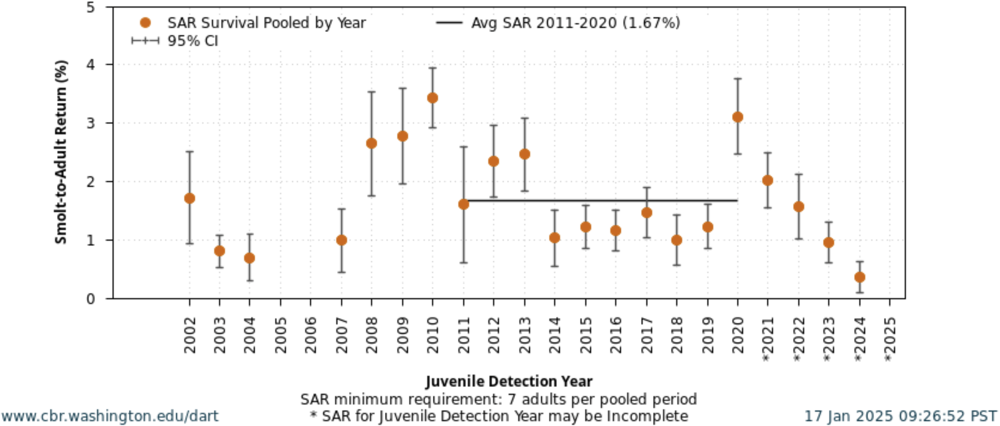

## Background

The factors that determine the marine survival and therefore recruitment of salmonid populations have long been of interest to ecologists and fisheries managers, and are a key determinant of the recovery of ESA-listed populations. Marine survival varies considerably both between salmon stocks and between years, as evinced by large variations in Smolt-to-Adult return (SAR) estimates [@Sharma2010]. This is evident in the Columbia River Basin, as seen in the following plots of SAR for three different populations:

 

 

 

 

Unraveling the factors that underlie variation in smolt-to-adult returns begins before salmonids even enter the marine environment. The freshwater experiences of juvenile salmon affect their survival in the ocean environment, in what are known as carryover effects [@Gosselin2018]. Influential carryover effects include rearing type, in-river transportation (i.e., barged vs. not barged), snow-water equivalent, river temperature, and oumtmigration timing [@Scheuerell2009; @Gosselin2018; @Gosselin2021]. Then, upon entering the Columbia River Estuary, outmigrating smolts encounter numerous predators, conspicuous among them nesting seabirds such as Caspian Terns, whose predation rates exceeded 20% of outmigrating smolts of some ESA-listed populations prior to management interventions that brought these predation rates down considerably [@Collis2024].

Once juveniles reach the oceanic environment, our conceptual understanding of marine survival is based primarily on the foundational work of @Pearcy1992 and @Beamish2001, who argued that marine survival is determined early in the oceanic phase, with survival being dependent on the ability to avoid predation and feed to satisfy metabolic requirements. An underlying and possibly unifying process that underlies marine survival is the "growth-mortality hypothesis" [@Anderson1988; @Miller1988], which states that growth of juvenile fish is a primary determinant of mortality, given that predation is often size-dependent. Multiple studies have found evidence to support this hypothesis for Columbia River salmon. Studies of marine survival in Snake River spring/summer [@Miller2014] and Columbia River spring Chinook salmon [@Tomaro2012] found that marine growth and size at capture were strongly positively related to survival, providing evidence for the growth-mortality hypothesis. Furthermore, direct evidence of predation on juvenile Chinook salmon by Pacific Hake and Jack Mackerel appears to support this hypothesis, as only small juvenile salmonids were found in predator stomachs [@Emmett2008].

Outgrowing size-dependent mortality and meeting metabolic needs are each ultimately related to food availability. In the classical recruitment literature, many hypotheses are put forward that describe the conditions necessary for fish to feed and grow. The first of these is known as the “match-mismatch hypothesis,” which states that the degree of spatiotemporal match or mismatch between fish and their prey leads to variable year class strength [@Cushing1975; @Cushing1990]. A second is the “Stable Ocean Hypothesis” as put forward by Reuben Lasker, which stated that it was not only the abundance of food, but also the degree of aggregation of food (which a stable, i.e., not turbulent, ocean was necessary for) that provided for good feeding conditions [@Lasker1981]. A third hypothesis, which is related to Lasker’s Stable Ocean Hypothesis, is the Optimal Environmental Window hypothesis [@Cury1989]. This states that in Ekman-type (wind-driven) upwelling systems, there exists an optimal window for larval and juvenile fish survival (and therefore recruitment). This optimal window is the result of the dome-shaped relationship between upwelling (which is related to turbulence) and recruitment. This is because at higher wind speeds, despite higher primary productivity, mixing begins to occur and disrupts the food aggregations necessary for larval fish to feed on, leading to a tradeoff between food availability and turbulence.

There have been multiple studies that have attempted to examine these hypotheses as they pertain to Columbia River salmonids, with mixed results. To test the match-mismatch hypothesis, @Tomaro2012 used four indicators: two indices of the copepod community based on sampling from the Newport Hydrographic Line (NHL), the lag between the physical spring transition date and juvenile emigration, and the lag between the biological spring transition date and juvenile emigration. They found no relationship between these four indicators and growth, did find a relationship between size at capture of juvenile salmonids and both the abundance of lipid-rich copepods and the timing of biological spring transition [@Tomaro2012]. In a similar study, @Miller2014 investigated the relationship between SAR and PDO, NPGO, an index of the copepod community from the NHL, the Columbia River Plume area, and the same lags between physical and biological transition dates and juvenile emigration. They found that some of these indicators performed well for hindcasting, but very poorly for forecasting [@Miller2014]. In a multivariate analysis of Columbia River Basin returns, @Burke2013 found that almost every indicator related to growth and feeding was informative, as were the PDO and ONI indices.

Across these studies, a major limitation is a lack of spatial information, as evinced by the coarse indicators used. While basin-scale indicators like PDO and NPGO have historically been useful for predicting salmon returns, these correlations appear to be breaking down [@Litzow2020], as correlations between these basin-scale indicators and local environmental indices continually change [@Gosselin2021]. As a result, spatially resolved data that better reflects the restricted and stock-specific areas used by juvenile salmon in their early marine residence [@Teel2015] may improve our mechanistic understanding of drivers of marine survival.

Multiple fisheries-independent surveys are operated in the Northern California Current that may provide an opportunity to uncover these mechanistic relationships. The first of these is the Juvenile Salmon and Ocean Ecosystem Survey (JSOES), which targets juvenile salmonids during the early part of their oceanic phase. The JSOES survey, which occurs in the summer, provides a snapshot of the distribution and abundance of juvenile salmonids, which migrate through the survey area at different rates, depending on their natal origin [@Fisher2014]. While the JSOES collects data on other ecosystem characteristics, other datasets are required that better sample other members of the marine food web; these surveys include the Pre-Recruit Survey, the Hake Survey, and California Current Ecosystem Survey, each of which are described under the "Survey Descriptions" tab. By integrating these datasets and using species distribution models, spatiotemporal overlap between juvenile salmonids, their predators, competitors, and prey can be estimated.

## References 

