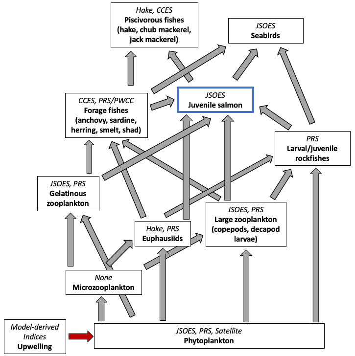
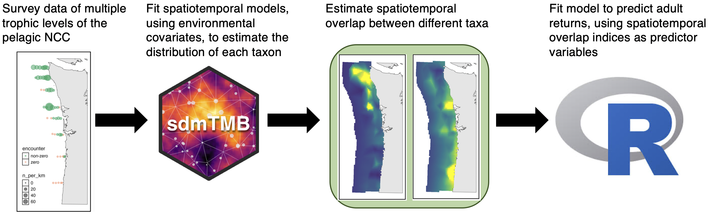

To model how the spatiotemporal overlap between juvenile salmonids and other taxa affects marine survival, we must begin with a conceptual model of how different members of the pelagic Northern California Current Food Web interact. Based on our understanding of this food web, and the interactions that juvenile salmonids have with different functional groups, we then develop specific hypotheses and describe how our modeling framework could be used to test those hypotheses.

 

### Conceptual model of the Northern California Current Food Web

The Northern California Current (NCC) is a highly productive upwelling ecosystem that is typically spatially defined as the portion of the California Current Ecosystem (CCE) between Vancouver Island, Canada, and Cape Mendocino, California [@Checkley2009]. In the CCE, phytoplankton grow in response to coastal, wind-driven upwelling which brings nutrient-rich water to the surface. Large phytoplankton (diatoms) respond strongly to upwelling and make up the bulk of primary production and biomass [@Kudela2008].

Grazers on phytoplankton include many different taxa. Microzooplankton are estimated to consume more than half of the primary productivity in coastal upwelling zones [@Calbet2004]. Microzooplankton make up a diverse group of small herbivores, including many protists, such as ciliates, dinoflagellates, and foraminiferans. In coastal upwelling systems like the CCE where the dominant phytoplankton are large diatoms, dinoflagellates are likely the dominant microzooplankton grazers due to their ability to ingest these long-chain phytoplankton [@Calbet2008]. Microzooplankton are often viewed as a trophic dead-end, where primary production ingested by microzooplankton is typically lost through multiple trophic transfers and remineralization instead of making its way up the food web [@Calbet2004]. However, they are also preyed upon by larger zooplankton such as copepods, although copepods eat more phytoplankton in productive systems like the CCE [@Calbet2008]. Microzooplankton are not sampled by recurring fisheries-independent surveys in the NCC, and therefore in our study we will assume their consumption of phytoplankton is constant.

The intermediate trophic level in the NCC is composed of diverse large zooplankton (alternatively defined as "mesozooplankton" or "macrozooplankton"), gelatinous zooplankton, and micronekton.  Large zooplankton include euphausiids, copepods, decapod larvae, amphipods, and pteropods. Micronekton include taxa like large crustaceans and small fish and squid. Many of these taxa are considered a sort of "trophic highway" between phytoplankton and fish, facilitating efficient energy transfer from primary producers to fish through a short food chain. Gelatinous zooplankton, which include various cnidarians, ctenophores, and some chordates (e.g. salps and pyrosomes), long considered a "trophic dead-end," may be more important to upper trophic level diets than previously considered, despite their low energy content [@Hays2018]. Krill (Euphausiidae spp.) typically dominate the biomass of the larger size class of this trophic level, composing the vast majority of the total catch in nighttime midwater trawls using a net with a 9.5 mm liner [@Brodeur2019]. Krill are omnivorous, with their diet likely primarily composed of phytoplankton, but supplemented by marine snow and small zooplankton [@Ohman1984; @Dorman2015].

Juvenile salmonids, our focal taxa, are a very small component of the fish community by biomass [@Gomes2024b], and are proportionally less abundant in the NCC than they are in other areas of the Northeast Pacific, such as the Gulf of Alaska [@Orsi2007]. Juvenile salmonids have a diverse diet that includes various fish, euphausiids, decapods, amphipods, copepods, and crab larvae [@Daly2009]. Juvenile salmonids undergo ontogenetic shifts in diet, with larger individuals consuming proportionally more fish [@Daly2009]. Piscivory is also more important for juvenile Chinook than for juvenile Coho salmon [@Daly2009].

Forage fishes in the NCC include Northern anchovy, Pacific sardine, smelts, Pacific herring, shad, and juvenile rockfishes. Forage fishes and juvenile salmonids interact through multiple pathways, with these interactions changing as juvenile salmonids grow. Early in their marine residence, juvenile salmonids and forage fishes compete for many of the same prey items, including euphausiids, decapods, and copepods [@Brodeur2019; @Daly2009]. As juvenile salmonids grow larger, they change from being competitors to being predators of forage fishes, as their diet shifts to eating predominantly juvenile forage fishes [@Daly2009]. The species composition of co-occurring fishes with juvenile salmonids has also changed considerably in the last decade, with increased overlap with juvenile sablefish, whose diets overlap with juvenile salmonids [@Daly2024], and more southerly species like Pacific Pompano [@Morgan2019a].

Forage fishes and juvenile salmonids also have shared predators, including piscivorous fishes and seabirds [@Szoboszlai2015]. While a very small portion of their diet, juvenile Chinook salmon were found in Jack Mackerel and Pacific Hake stomachs [@Emmett2008], and a negative relationship between Pacific Hake abundance and Coho marine survival was found [@Emmett2006]. Considerable diet overlap between piscovorous fishes and juvenile salmonids also indicate that species like Pacific Hake and Jack Mackerel likely compete with, as well as directly prey upon, juvenile salmonids [@Emmett2008]. Under the assumption that seabirds exhibit no prey preference between juvenile salmonids and forage fishes, some modeling studies have found that the presence of forage fishes can reduce predation on co-occurring juvenile salmonids by about 70%. However, it is also believed that ocean distribution patterns of seabird predators of juvenile salmonids such as common murres and sooty shearwaters are driven by the distributions of more abundant forage fishes [@Zamon2024]; this implies that increased overlap between juvenile salmonids and forage fishes in the marine environment may sometimes lead to increased predation risk.

It must also be noted that the food web of the NCC is not static; for example, the marine heatwave from 2014-2016 led to highly anomalous abundances of different taxa, with potential impacts for the full food web [@Brodeur2019; @Morgan2019a]. Ecosystem models parameterized using pre-blob and post-blob time series found significant changes in the trophic structure of the food web, particularly an increase in pyrosomes post-blob that diverted a significant amount of primary productivity away from consumers [@Gomes2024a].

Based on this literature, we developed the following simplified pelagic food web of the NCC. Major functional groups are shown in bold, and the abbreviations of the surveys that sample these functional groups are shown in italics. 

 

 

### Hypotheses

To study the structure and function of the NCC food web, sampling with a much higher temporal resolution would be required due to the short generation times of many of the key taxa. With juvenile salmonids, we are able to estimate the impacts of some interactions by using smolt-to-adult return ratios (SAR) or adult returns as our response variable, and metrics of interactions between taxa as our predictor variables. With this in mind, we present our hypotheses using the following model directed acyclic diagram (DAG).

1. Spatiotemporal overlap between juvenile salmonids and key prey items, such as euphausiids, juvenile forage fishes, and large zooplankton leads to higher adult returns.
2. Spatiotemporal overlap between juvenile salmonids and adult forage fishes may have positive or negative influences on adult returns due to the different potential interactions between these groups.
3. Spatiotemporal overlap between juvenile salmonids and predators, such as piscivorous fishes including hake, chub mackerel, and jack mackerel, as well as seabirds (e.g., Common Murres and Sooty Shearwaters) leads to lower adult returns.
4. Spatiotemporal overlap between juvenile salmonids and satellite-measured primary productivity leads to higher adult returns.

 

 

## Project workflow

Overview of methods:

1. For each taxon, fit a spatiotemporal model to model the abundance and distribution in the JSOES survey area. Species distribution models will be fit using environmental covariates, including chl-a, temperature, and distance from the shore or shelf break.
2. Estimate the degree of overlap between the distributions of different species in each year. Many metrics exist to quantify spatial predator-prey overlap [@Carroll2019].
3. Fit a model using either SAR or adult returns as the response variable and metrics of overlap (in addition to other factors that we already know are important for survival, e.g., outmigration timing) as predictors.

 

 

## References 

