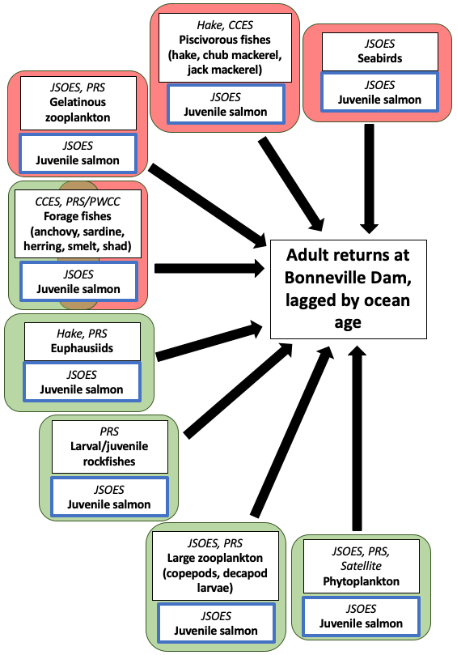

## Background

Marine survival is highly variable, both between stocks and between years. Marine survival of Columbia River Basin salmonids has been repeatedly studied.

However, these studies only looked at ecological information at a very coarse, or spatially coherent scale. PDO and NPGO are basin-scale; we know from tagging studies that these stocks use a small portion of the Northeast Pacific.

Studies of marine survival in Snake River spring/summer [@Miller2014] and Columbia River spring Chinook salmon [@Tomaro2012] found stronger evidence for the importance of early growth than regional productivity. However, the metrics used in these studies were spatially unresolved, as dates of biological or physical spring transition dates were used to measure temporal overlap between salmon and prey, and indices of copepod productivity from the Newport Hydrographic Line were used as metrics of prey quality. 

Species distribution models are an opportunity to study spatiotemporal overlap between juvenile salmonids, their predators, competitors, and prey.

The JSOES survey collects a lot of key information, and uses genetic methods to identify origin and rear type. It's a great data source to start with for unraveling this problem.

However, the JSOES survey provides insights into only certain elements of the Northern California Current food web. Other datasets need to be integrated to be able to take a holistic look at marine survival.

This is a website to be shared with data owners, who will need to be convinced that this project is worth their time. Need to answer the following questions:
- Why is this question important?
- Why is this analysis timely (why now?)
- What's new and interesting about our methods? 1) Using SDMs, whereas past studies typically just looked by station; 2) we're trying to combine datasets, most past analyses are isolated to their surveys. Some studies (e.g., Friedman et al. 2018) combine RREAS and PRS surveys, since they have similar sampling methods and target taxa, but are in different spatial areas. This study is different because we look at multiple surveys conducted in the same area, which gives us the advantage of looking at taxa across trophic levels.

In relation to a theme that I frequently think about: theory (Wells et al. 2016?) suggests certain mechanisms for recruitment, but studies so far (Miller et al. 2014 and Tomaro et al. 2012, for example) didn't find evidence for those mechanisms. BUT - those studies likely didn't have the ability to really detect these effects. So we can't falsify that hypothesis.

The Northern California Current

Some key evidence points to overlap between juvenile salmon and their prey as being crucial for determining adult returns. 

Scheuerell et al. (2009): 

For both species, juveniles migrating from early to mid-May survived 4–50 times greater than
those migrating in mid-June. As expected, however, the estimated peak in survival varied among
years, presumably reflecting interannual variation in the nearshore physical environment and tro-
phic dynamics that affect salmon during the critical juvenile life stage.

What do we know about marine survival? What is our conceptual model of how the NCC food web works, especially as it pertains to juvenile salmonids (ad therefore, their marine survival)?

What is the structure of the NCC food web? 

How much do CPS move throughout the year? How representative of their distributions are snapshots in July (CCES), for example?

Where is the krill data from the CCES? I don't see publications about it?

### Conceptual model of the Northern California Food Web

The Northern California Current (NCC) is a highly productive upwelling ecosystem that is typically spatially defined as the portion of the California Current Ecosystem (CCE) between Vancouver Island, Canada, and Cape Mendocino, California [@Checkley2009]. In the CCE, phytoplankton grow in response to coastal, wind-driven upwelling which brings nutrient-rich water to the surface. Large phytoplankton (diatoms) respond strongly to upwelling and make up the bulk of primary production and biomass [@Kudela2008].

Grazers on phytoplankton include many different taxa. Microzooplankton are estimated to consume more than half of the primary productivity in coastal upwelling zones [@Calbet2004]. Microzooplankton make up a diverse group of small herbivores, including many protists, such as ciliates, dinoflagellates, and foraminiferans. In coastal upwelling systems like the CCE where the dominant phytoplankton are large diatoms, dinoflagellates are likely the dominant microzooplankton grazers due to their ability to ingest these long-chain phytoplankton [@Calbet2008]. Microzooplankton are often viewed as a trophic dead-end, where primary production ingested by microzooplankton is typically lost through multiple trophic transfers and remineralization instead of making its way up the food web [@Calbet2004]. However, they are also preyed upon by copepods, although copepods eat more phytoplankton in productive systems like the CCE [@Calbet2008]. Microzooplankton are poorly sampled in the NCC.

The intermediate trophic level in the NCC is composed of diverse large zooplankton (alternatively defined as "mesozooplankton" or "macrozooplankton"), gelatinous zooplankton, and micronekton.  Large zooplankton include euphausiids, copepods, decapod larvae, amphipods, and pteropods. Micronekton include taxa like large crustaceans and small fish and squid. Many of these taxa are considered a sort of "trophic highway" between phytoplankton and fish, facilitating efficient energy transfer from primary producers to fish through a short food chain. Gelatinous zooplankton, which include various cnidarians, ctenophores, and some chordates (e.g. salps and pyrosomes), long considered a "trophic dead-end," may be more important to upper trophic level diets than previously considered, despite their low energy content [@Hays2018]. Krill (Euphausiidae spp.) have historically dominated the biomass of the larger size class of this trophic level, composing the vast majority of the total catch in nighttime midwater trawls using a net with a 9.5 mm liner [@Brodeur2019]. Krill are omnivorous, with their diet likely primarily composed of phytoplankton, but supplemented by marine snow and small zooplankton [@Ohman1984; @Dorman2015].

Juvenile salmonids, our focal taxa, are a very small component of the fish community by biomass [@Gomes2022a], and are proportionally less abundant in the NCC than they are in other areas of the Northeast Pacific, such as the Gulf of Alaska [@Orsi2007]. Juvenile salmonids have a diverse diet that includes various fish, euphausiids, decapods, amphipods, copepods, and crab larvae [@Daly2009]. Juvenile salmonids undergo ontogenetic shifts in diet, with larger individuals consuming proportionally more fish [@Daly2009]. Piscivory is also more important for juvenile Chinook than for juvenile Coho salmon [@Daly2009].

Forage fishes in the NCC include Northern Anchovy, Pacific sardine, smelts, Pacific herring, shad, and juvenile rockfishes. Forage fishes and juvenile salmonids interact through multiple pathways, with these interactions changing as juvenile salmonids grow. Early in their marine residence, juvenile salmonids and forage fishes compete for many of the same prey items, including euphausiids, decapods, and copepods [@Brodeur2019; @Daly2009]. As juvenile salmonids grow larger, their diet shifts to eating predominantly juvenile forage fishes [@Daly2009], leading to a change from a competitive to a predator-prey relationship. The species composition of co-occurring fishes with juvenile salmonids has also changed considerably in the last decade, with increased overlap with juvenile sablefish, which have a moderate diet overlap with juvenile salmonids [@Daly2024], and more southerly species like Pacific Pompano [@Moragn2019].

Forage fishes and juvenile salmonids also have shared predators, including piscivorous fishes and seabirds [@Szoboszlai2015]. Under the assumption that seabirds exhibit no prey preference between juvenile salmonids and forage fishes, some modeling studies have found that the presence of forage fishes can reduce predation on co-occurring juvenile salmonids by about 70%. However, it is also believed that ocean distribution patterns of seabird predators of juvenile salmonids such as common murres and sooty shearwaters are driven by the distributions of more abundant forage fishes [@Zamon2024]; this implies that increased overlap between juvenile salmonids and forage fishes in the marine environment may sometimes lead to increased predation risk.

Based on this literature, we developed the following simplified pelagic food web of the NCC. Major functional groups are shown in bold, and the abbreviations of the surveys that sample these functional groups are shown in italics. 

It must also be noted that the food web of the NCC is not static; for example, the marine heatwave from 2014-2016 led to highly anomalous abundances of different taxa, with potential impacts for the full food web [@Brodeur2019; @Morgan2019]. Ecosystem models parameterized using pre-blob and post-blob time series found significant changes in the trophic structure of the food web, particularly an increase in pyrosomes post-blob that diverted a significant amount of primary productivity away from consumers [@Gomes2024].

### Hypotheses

To study the structure and function of the NCC food web, sampling with a much higher temporal resolution would be required due to the short generation times of many of the key taxa (i.e., there is no clear response variable, such as abundance in the next time step). With juvenile salmonids, we are able to estimate the impacts of some interactions by using smolt-to-adult return ratios (SAR) or adult returns as our response variable, and metrics of interactions between taxa as our predictor variables. With this in mind, we present our hypotheses using the following model directed acyclic diagram (DAG).

1. Spatiotemporal overlap between juvenile salmonids and key prey items, such as euphausiids, juvenile forage fishes, and large zooplankton leads to higher adult returns.
2. Spatiotemporal overlap between juvenile salmonids and adult forage fishes may have positive or negative influences on adult returns due to the different potential interactions between these groups.
3. Spatiotemporal overlap between juvenile salmonids and predators, such as piscivorous fishes including hake, chub mackerel, and jack mackerel, as well as seabirds (e.g., Common Murres and Sooty Shearwaters) leads to lower adult returns.
4. Spatiotemporal overlap between juvenile salmonids and satellite-measured primary productivity leads to higher adult returns.

## Potential projects

#### 1) Can we used derived quantities from spatiotemporal models to uncover mechanistic relationships that explain marine survival as some function of the distribution and abundance of juvenile salmon, their predators and prey, and their environment?

Overview of methods:

1. For each taxon, fit a spatiotemporal model to model the abundance and distribution in the JSOES survey area
2. Estimate the degree of overlap between the distributions of different species in each year
3. Fit a model using some metric of survival or adult returns as the response variable and metrics of overlap (in addition to other factors that we already know are important for survival, e.g.,outmigration timing) as predictors. This statistical model could be written as an integrated model in TMB that estimates SAR (from PIT tag data) as a function of our overlap metrics and other predictors.

#### 2) How does the Northern California Current Ecosystem respond to environmental variability, as mediated through food web interactions?

The approach used for this question would be quite similar to the first question, except that the analysis would be on the scale of the ecological community. The effect of environmental covariates on species distributions and abundance would be estimated along with interaction strengths between different members of the community using a food web model. Salmon would still be central to this analysis and many similar insights would be gleaned regarding marine survival, but the results would be applicable to ecosystem-based management.

## References 

 
