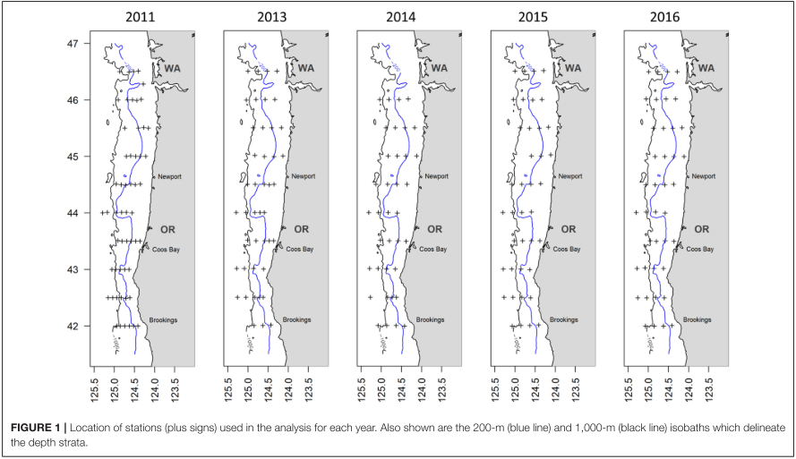

For this study, we will have temporal overlap between all data sources from 2006-2020 (Hake only odd years), and spatial overlap across the whole JSOES sampling area, except for Pre-Recruit Survey (which will only cover the southern 2/3 of the survey grid to the Columbia River Plume).

<br>

## Survey temporal resolution

```{r gantt_chart_surveys, echo = FALSE, warning=FALSE, message = FALSE}
## ganttrify - make timeline for thesis proposal

# remotes::install_github("giocomai/ganttrify")
library(ganttrify)
library(tidyverse)


# survey <- c("JSOES", "CCES", "PRS", "Hake", "Adult Returns")
survey <- c("JSOES", "CCES", "PRS", "Adult Returns")

# start_date <- c(1998, 2006, 2005, 2003, 1998)
# 
# end_date <- c(2024, 2024, 2024, 2024, 2020)

# start_date <- c(1, 8*12, 7*12, 5*12, 1)
# start_date <- c(1, 8*12, 7*12, 1)
# change CCES start date to 2015
start_date <- c(1, 17*12, 7*12, 1)


# end_date <- c(26*12, 26*12, 26*12, 26*12, 22*12)
end_date <- c(26*12, 26*12, 26*12, 22*12)

# split hake apart into biennial surveys
hake_surveys <- rep("Hake", length(c(seq(2003, 2023, 2), 2012)))
hake_start_date <- c(seq(5, 25, 2)*12, 14*12)
hake_end_date <- c(seq(6, 26, 2)*12, 15*12)
hake_surveys_df <- data.frame(wp = rep("Survey", length(hake_surveys)),
                              acitivty = hake_surveys, start_date = hake_start_date, 
                              end_date = hake_end_date)


surveys_df <- data.frame(wp = rep("Survey", 4), acitivty = survey, start_date, end_date)

surveys_df %>% 
  bind_rows(hake_surveys_df) -> surveys_df

# change how these align to years
surveys_df$start_date <- surveys_df$start_date - 6
surveys_df$end_date <- surveys_df$end_date - 6

surveys_plot <- ganttrify(project = surveys_df,
          project_start_date = "1998-01",
          hide_wp = TRUE,
          size_text_relative = 1.2,
          month_breaks = 12,
          month_number_label = FALSE,
          mark_quarters = FALSE,
          show_vertical_lines = FALSE,
          colour_stripe = "white") +
    theme(axis.title.x=element_blank()) +  
  scale_x_date(date_breaks = "2 years", date_labels = "%Y", breaks = seq(1998, 2024, 2)) +
  ggtitle("NCC Survey Temporal Coverage")

surveys_plot
```

<br>

## Survey spatial resolution

### JSOES

{width=50%}

<br>

### CCES


<br>

### PRS



<br>

### Hake

{width=50%}

<br>
<br>

#### References
