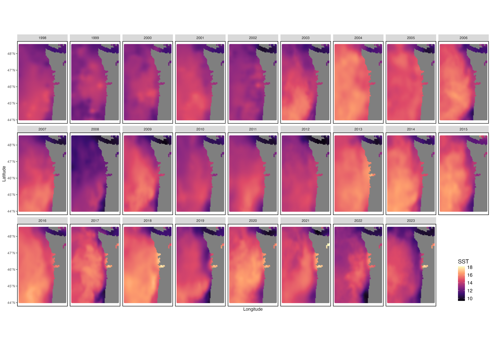
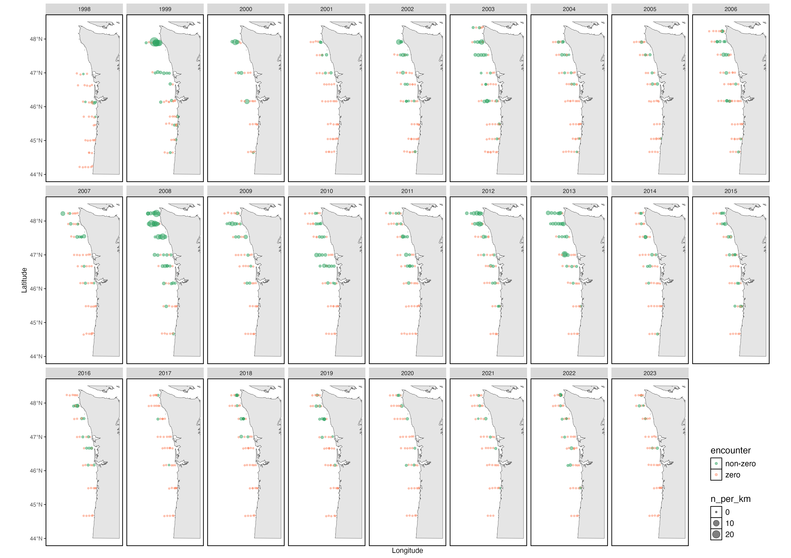
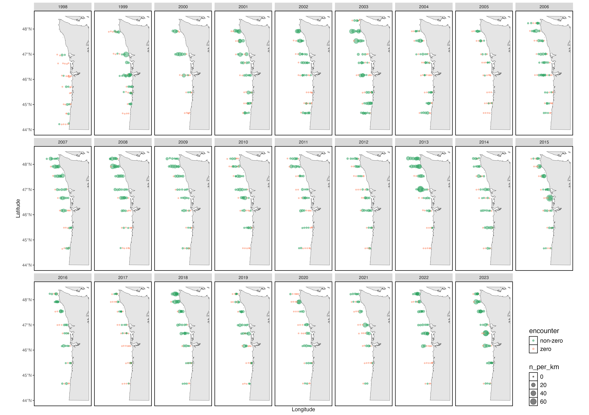
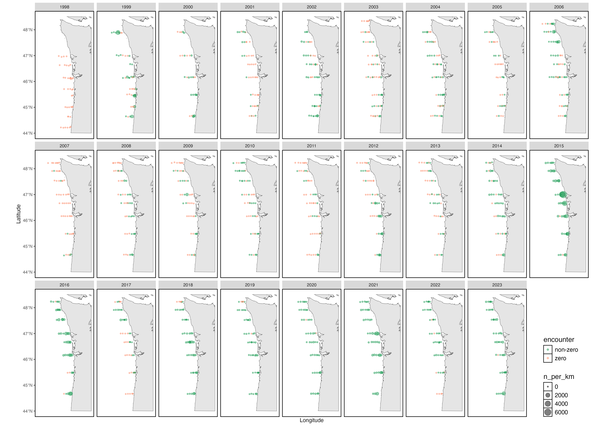
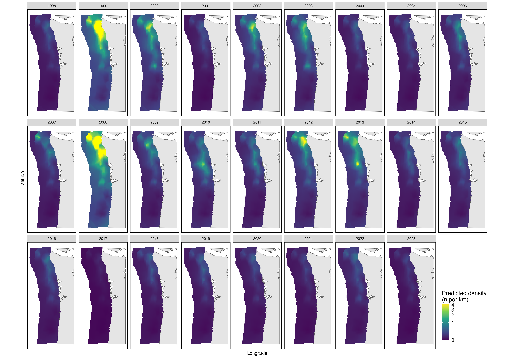
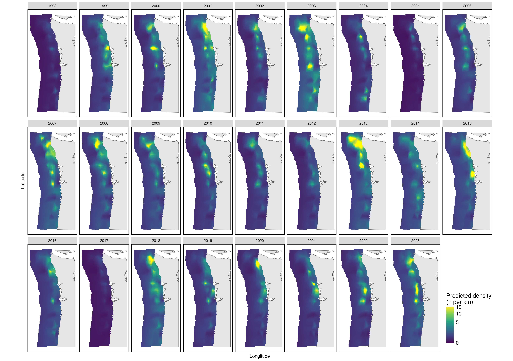
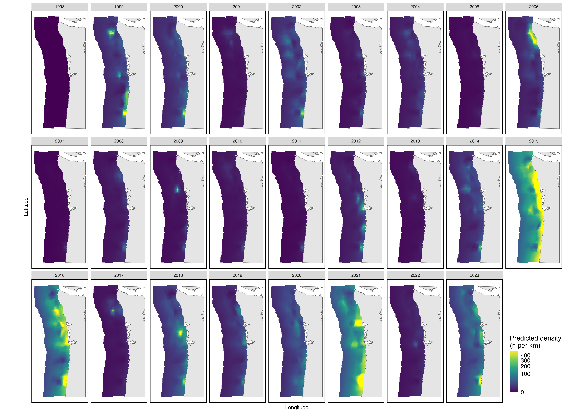

\floatplacement{figure}{H}

## Abstract

The oceanic phase of the life history of Pacific salmon has often been viewed as a black box, with differences in marine survival driving adult returns, but with little understanding of what factors determine marine survival. In the Northern California Current, the Juvenile Salmon and Ocean Ecology Survey (JSOES) has been sampling juvenile salmonids and other pelagic taxa since 1998, providing a long time series of the abundance and distribution of many species through time that may provide insight into these mechanisms. In this study, I fit spatiotemporal models to estimate the abundance and distribution of three taxa over time: Yearling Spring Chinook Salmon from the Interior Columbia River Basin, Yearling Coho Salmon, and water jellies. Using these three species, I present a case study of how spatiotemporal models can estimate the effect of environmental covariates on species distributions and estimate management relevant indices, such as single-species indices of abundance and the degree of overlap between different species (to quantify the potential for ecological processes like competition or predation). These models reveal a huge increase in water jelly abundance beginning with the Blob in 2014-2016 which coincides with a sharp decrease in Yearling Spring Chinook Salmon from the Interior Columbia River Basin. These species distribution models also suggest that this population of Chinook salmon primarily occupies waters off of Washington from the nearshore to ~50 km offshore, whereas Yearling Coho salmon and water jellies are found closer to shore.

## Introduction

Pacific salmon (*Oncorhynchus spp.*) are an iconic group of species in the Pacific Northwest, with tremendous importance for commercial, recreational, and Indigenous fisheries. This importance has led to a long history of study of these species, but with unequal research effort across the different life history stages of these anadromous species. While the freshwater and estuarine phases of Pacific salmon on the U.S. West Coast have a long and extensive history of study, the ocean ecology of these stocks has only been a major research focus for the past 25 years [@Wells2020]. This increased emphasis on the study of salmon ocean ecology arose with observations of the interannual variability in smolt-to-adult returns and an increased recognition that it is marine survival that determines recruitment strength [@Beamish2001]. However, mechanisms that explain high variability in marine survival remain elusive [@Wells2020].

During their oceanic phase, salmon are at the same time predators, prey, and competitors, and these ecological roles change as they grow [@Wells2020], making uncovering mechanisms difficult. Predation has been implicated as the major source of mortality for salmon in the ocean, with predation by piscivorous fishes [@Emmett2006] and seabirds [@Wells2017] linked to decreases in ocean survival. While their low abundance relative to other forage species implies that juvenile salmon may not be the primary target of predators, incidental mortality of juvenile salmon due to their co-occurrence with other forage species (e.g., anchovies) has been linked to decreases in marine survival [@Emmett2006; @Wells2017]. Another mechanism that influences predation pressure on juvenile salmon is size-dependent mortality, where smaller individuals are selectively predated [@Tucker2016; @Woodson2013]. As growth is linked to the availability of prey [@Litz2017], the availability and composition of forage for juvenile salmon is also likely to influence marine survival. Juvenile salmonids may also experience intraspecific (density dependence) or interspecific competitive pressure. For example, stable isotope analysis indicates that these Coho and Chinook salmon have similar trophic niches [@Johnson2009], suggesting potential competition.

Together, these various mechanisms indicate multiple pathways that could influence how marine survival varies interannually. These pathways can be measured spatially by quantifying how the spatial distribution of salmon varies interannually, and how it overlaps with other key groups, specifically: 1) Overlap with salmon prey; 2) Overlap with predators; 3) Overlap with other prey species; and 4) Overlap with competitors. By fitting a species distribution model to a multi-decadal survey of juvenile salmon and co-occurring species in the Northern California Current, we show how these models can be used to quantify this overlap. In this study, we focus on three species as a proof of concept: Yearling Spring Chinook salmon (Interior Columbia River Basin), Yearling Coho salmon, and water jellies. We also use the outputs from this model to develop indices of abundance to quantify changes in abundance through time.


## Methods

### JSOES

The data for this study were collected by the Juvenile Salmon and Ocean Ecology Survey (JSOES), which has conducted annual surveys of the surface waters off the coast of Washington and Oregon since 1998 (Fig. 1). JSOES data has been used to address a number of research questions related to the abundance and distribution of salmon stocks [e.g., @Teel2015] and is currently being used to generate indicators of the abundance of juvenile salmon and other surface-oriented taxa in the Northern California Current for the annual Ecosystem Status Report [@Leising2024]. This survey samples surface-oriented pelagic taxa using a 264 Nordic pelagic rope trawl along multiple trasect lines perpendicular to shore (Fig. 1). Trawls are conducted during daylight hours, and the net is towed for approximately 30 minutes at 6 km/h. The net has a mouth opening of 30 m × 20 m, and the head rope is approximately 1 m from the surface. Although the survey has been conducted in May, June, and September, only the June survey was retained for this analysis, as it is the only month which has been sampled every year. CTD depth profiles were conducted at all sampling stations, and the CTD sample at 3 m depth was be paired with the tow to provide a measure of sea surface temperature.

{width=40%}

### Covariates

To predict species distributions using sea surface temperature (SST) as a covariate, the Sea Surface Temperature, NOAA Coral Reef Watch Daily Global 5km Satellite SST (CoralTemp) dataset was downloaded from the [NOAA ERDDAP server](https://coastwatch.noaa.gov/erddap/griddap/noaacrwsstDaily.html). This dataset contains daily SST measurements at a spatial resolution of 5 km/0.05 degrees. To generate the prediction grid for each year, only the SST values on June 24, which was the mean day of year across all samples in our dataset, was used. Future analyses may investigate other ways to generate a yearly SST measurement, such as by averaging over a window. Sea surface temperature by year can be seen in Fig. 2.

{width=100%}

Distance from shore was also used as a covariate to predict distributions, as the taxa investigated here typically remain relatively close to shore [@Wells2020]. Bathymetric depth was also considered as a covariate, but because depth and distance from shore are highly correlated and the species investigated here are surface-oriented taxa, we chose to include distance from shore as a covariate. For every sample, as well as for every point in the prediction grid, distance from shore was calculated using the `st_distance()` function from the `sf` package [@Pebesma2018] to calculate the distance between either sampling or prediction locations and a shapefile of the North American coastline.


### Statistical model

To model the distribution of each species across the study period, spatiotemporal models were implemented, where the same model was coded with both bespoke TMB code and the package sdmTMB [@Anderson2022a]. After confirming that the model outputs from the bespoke TMB code and sdmTMB were the same, outputs from the sdmTMB model were used to calculate derived quantities. In all cases, the spatial and spatiotemporal random effects were modeled using the Stochastic Partial Differential Equation (SPDE) approximation to the Gaussian random field. A mesh for SPDE was generated using a cutoff of 10 km for the minimum triangle length (Fig. 3).

{width=40%}

Three different models with different structures for the spatial, temporal, and spatiotemporal effects were tested:

1. A null model (main effects for space and year)
2. A model with main effects for space and year, and a spatio-temporal variable
3. A model with main effects for space and year, and a spatio-temporal variable, where the spatio-temporal variable is modeled as an autoregressive process.

Originally, I had planned to also fit two more models as extensions of model 3:

4. A model with main effects for space and year, and a spatio-temporal variable, but where the effect of year is modeled as an autoregressive process
5. A model with main effects for space and year, and a spatio-temporal variable, but where the effects of both year and the spatio-temporal effects are modeled as autoregressive processes

However, while my bespoke TMB code worked for both of these models, the sdmTMB implementation failed, with the following error message: `Error in solve.default(h, g) : system is computationally singular: reciprocal condition number = 1.84191e-29`. As such, I did not include these models in the model selection process. I would appreciate feedback on how to troubleshoot this error.


#### Model descriptions


The first model that I fit is a model with main effects for space and year. This model assumes that there is an effect of year and an effect of space, but these factors do not interact. This is our null model (referred to later as the "Null" model), and has the following equation:

$$
\begin{split}
log(d_{s,t}) \sim \beta_t + \omega_s \\
\omega \sim \textrm{MVN}(\textbf{0},\Sigma)
\end{split}
$$

Where:

- $s$ is the station
- $t$ is the year
- $d$ is the density of a species caught in a tow, expressed in terms of individuals per kilometer towed
- $\beta_t$ is the median density in year t
- $\omega_s$ is the density for location $s$ relative to the median location that is typical across years
- $\Sigma$ is the spatial variance. Because we are using the SPDE method, $\Sigma$ is $Q_{spde}^{-1}$.

The second model adds a term for a spatio-temporal variable, $\epsilon_{s,t}$. This is referred to later as the "Spatiotemporal" model), and has the following equation:

$$
\begin{split}
log(d_{s,t}) \sim \beta_t + \omega_s + \epsilon_{s,t}\\
\omega \sim \textrm{MVN}(\textbf{0},\sigma_\omega^2\textbf{R}_\omega) \\
\epsilon_{t} \sim \textrm{MVN}(\textbf{0},\sigma_\epsilon^2\textbf{R}_\epsilon)
\end{split}
$$

Where:

- $s$ is the station
- $t$ is the year
- $d$ is the density of a species caught in a tow, expressed in terms of individuals per kilometer towed
- $\beta_t$ is the median density in year t
- $\omega_s$ is the density for location $s$ relative to the median location that is typical across years
- $\epsilon_{s,t}$ is a spatio-temporal variable that describes the effect of each combination of year and location on density
- $\textbf{R}_\omega$ = $\textbf{R}_\epsilon$ is the spatial correlation. These are the same because the correlation structure is set up using the SPDE method.
- $\sigma_\omega$ is the spatial variance. This is controlled by the parameter $\tau_\omega$ in the SPDE calculation.
- $\sigma_\epsilon$ is the spatio-temporal variance. This is controlled by the parameter $\tau_\epsilon$ in the SPDE calculation.

However, because we are using the SPDE method to model a precision matrix for our grid that will then be shared for both the spatial ($\omega_s$) and spatio-temporal ($\epsilon_{s,t}$) terms, $\sigma_\omega^2\textbf{R}_\omega$ =  $\sigma_\epsilon^2\textbf{R}_\epsilon$ = $\Sigma$ = $Q_{spde}^{-1}$.


The third model now models the spatio-temporal variable, $\epsilon_{s,t}$, as a temporally autocorrelated process. This is referred to later as the "Spatiotemporal, AR1" model), and has the following equation:

$$
\begin{split}
log(d_{s,t}) \sim \beta_t + \omega_s + \epsilon_{s,t}\\
\omega \sim \textrm{MVN}(\textbf{0},\sigma_\omega^2\textbf{R}_\omega) \\
  \mathbf{\epsilon}_t \sim 
  \begin{cases}
    \mathrm{MVN}\left( \mathbf{0}, \frac{1}{1-\rho_{\epsilon}^2} \sigma_\epsilon^2\textbf{R}_\epsilon \right) & \text{if } t=1 \\ 
    \mathrm{MVN}( \rho_{\epsilon} \mathbf{\epsilon}_{t-1}, \sigma_\epsilon^2\textbf{R}_\epsilon ) & \text{if } t>1 
  \end{cases}
\end{split}
$$

Where:

- $s$ is the station
- $t$ is the year
- $d$ is the density of a species caught in a tow, expressed in terms of individuals per kilometer towed
- $\beta_t$ is the median density in year t
- $\omega_s$ is the density for location $s$ relative to the median location that is typical across years
- $\epsilon_{s,t}$ is a spatio-temporal variable that describes the effect of each combination of year and location on density
- $\rho_{\epsilon}$ is the magnitude for first-order autocorrelation in spatio-temporal variation
- $\textbf{R}_\omega$ = $\textbf{R}_\epsilon$ is the spatial correlation. These are the same because the correlation structure is set up using the SPDE method.
- $\sigma_\omega$ is the spatial variance. This is controlled by the parameter $\tau_\omega$ in the SPDE calculation.
- $\sigma_\epsilon$ is the spatio-temporal variance. This is controlled by the parameter $\tau_\epsilon$ in the SPDE calculation.

However, because we are using the SPDE method to model a precision matrix for our grid that will then be shared for both the spatial ($\omega_s$) and spatio-temporal ($\epsilon_{s,t}$) terms, $\sigma_\omega^2\textbf{R}_\omega$ =  $\sigma_\epsilon^2\textbf{R}_\epsilon$ = $\Sigma$ = $Q_{spde}^{-1}$.


To select a best model, we underwent a process of model selection using AIC and cross-validation. Cross-validation is generally considered to be a better method for comparing models, as unlike AIC, it can also factor in uncertainty in random effects. For each model, we used the `sdmtmb_cv()` function with four folds, and then compared model performance by comparing the sum of log likelihoods across the multiple folds. We only conducted model selection for one species (Yearling Spring Chinook salmon, Interior Columbia River Basin), and then used the same model structure for the other two species. This was done to maintain the same model structure across all species, although in the future a full model selection process will be conducted for each species. After selecting a best model from the above three candidate models, we added two covariates, SST and distance from shore, as predictors of density. Both of these predictors were z-scored prior to model fitting. This resulted in the following model (referred to later as the "Spatiotemporal, AR1 + SST + Dist" model), which has the following equation:

$$
\begin{split}
log(d_{s,t}) \sim \beta_t + \textbf{x}_{s,t}\gamma + \omega_s + \epsilon_{s,t} \\
\omega \sim \textrm{MVN}(\textbf{0},\sigma_w^2\textbf{R}_w) \\
  \mathbf{\epsilon}_t \sim 
  \begin{cases}
    \mathrm{MVN}\left( \mathbf{0}, \frac{1}{1-\rho_{\epsilon}^2} \sigma_\epsilon^2\textbf{R}_\epsilon \right) & \text{if } t=1 \\ 
    \mathrm{MVN}( \rho_{\epsilon} \mathbf{\epsilon}_{t-1}, \sigma_\epsilon^2\textbf{R}_\epsilon ) & \text{if } t>1 
  \end{cases}
\end{split}
$$

Where:

- $s$ is the location
- $t$ is the year
- $d$ is the density of a species caught in a tow, expressed in terms of individuals per kilometer towed
- $\beta_t$ is the median density in year t
- $\textbf{x}_{s,t}$ is a vector containing the values of the covariates (SST and distance from shore) at location $s$ in year $t$
- $\gamma$ is a vector containing the parameters that describe the fixed effects of the covariates
- $\omega_s$ is the density for location $s$ relative to the median location that is typical across years
- $\epsilon_{s,t}$ is a spatio-temporal variable that describes the effect of each combination of year and location on density
- $\rho_{\epsilon}$ is the magnitude for first-order autocorrelation in spatio-temporal variation
- $\textbf{R}_\omega$ = $\textbf{R}_\epsilon$ is the spatial correlation. These are the same because the correlation structure is set up using the SPDE method.
- $\sigma_\omega$ is the spatial variance. This is controlled by the parameter $\tau_\omega$ in the SPDE calculation.
- $\sigma_\epsilon$ is the spatio-temporal variance. This is controlled by the parameter $\tau_\epsilon$ in the SPDE calculation.

However, because we are using the SPDE method to model a precision matrix for our grid that will then be shared for both the spatial ($\omega_s$) and spatio-temporal ($\epsilon_{s,t}$) terms, $\sigma_\omega^2\textbf{R}_\omega$ =  $\sigma_\epsilon^2\textbf{R}_\epsilon$ = $\Sigma$ = $Q_{spde}^{-1}$.


$\textbf{x}_{s,t}$ includes the following parameters whose effects are described in $\gamma$:

- SST (degrees Celsisus)
- Distance from shore in km


### Area-weighted index of abundance

To calculate the area-weighted index of abundance for each year, we used the predictions from the sdmTMB model for each cell in our area. This was implemented using the `get_index()` function from sdmTMB.

### Species overlap

Using the best fit model identified in the previous step, we calculated the overlap between the distributions of different taxa. While there are many metrics that can described the overlap between two species [@Carroll2019], we applied the local index of collocation metric [@Pianka1973]. This measures the co-occurrence by estimating the correlation of densities of two species $A$ and $B$, and uses the following equation:
$$
\frac{\sum\limits_{i=1}^n (p\_A_i*p\_B_i) }{\sqrt{\sum\limits_{i=1}^n p\_A_i^2 * \sum\limits_{i=1}^n p\_B_i^2}}
$$
Where:

- $i$ is the sample
- $n$ is the total number of samples
- $p\_A_i$ and $p\_B_i$ are the proportions of the total number of predator and prey in a given area


In this study, we use this metric to investigate how both competition between two species (Chinook salmon and Coho salmon, as described in the introduction) and predator-prey overlap (Chinook salmon and water jellies) vary through space and time. Because of the selectivity of this survey (owing to both a larger mesh size and the diel vertical migration of many important prey species), many of the most common prey items for Chinook salmon (e.g., juvenile rockfishes, crab larvae) are not well sampled by this survey. However, as a proof of concept for measuring predator-prey overlap, we examine overlap between Chinook salmon distribution and that of water jellies (*Aequeora* spp.). We chose water jellies as an example prey species as Chinook salmon have been observed to eat some gelatinous zooplankton [@Daly2009] and they may serve as a proxy for poor feeding conditions given their lower energy content relative to other types of prey [@Brodeur2019].


## Results

### Data

Yearling Spring Chinook salmon (Interior Columbia River Basin) tend to be more abundant in the northern part of the survey domain, but abundance appears to be lower in the last ten years (Fig. 4). Yearling Coho salmon venture further south, and do not exhibit strong temporal trends (Fig. 5). Water jellies have become considerably more abundant throughout the survey area in the last ten years, with particularly high abundance during the blob years of 2014-2016 (Fig. 6).


{width=100%}

{width=100%}

{width=100%}


### Spatiotemporal modeling

According to our model selection procedure, the model where spatiotemporal random effects are modeled as an autoregressive process, and the same model with covariates added, have very similar support (1 log likelihood apart, within 2 units of AIC, Table 1). I chose to proceed with the model that included our two habitat covariates for all species.

```{r message = FALSE, warning = FALSE, echo = FALSE}
model_selection_table <- read.csv(here::here("figures","csyis_model_selection_table.csv"), row.names = 1)

model_parameters_table <- read.csv(here::here("figures","model_parameters_table.csv"), row.names = 1)

library(kableExtra)

model_selection_table %>% 
  dplyr::rename("Model" = "model", "CV Total Log Likelihood" = "cv_total_log_likelihood") %>% 
  kbl(caption = "AIC and the total log likelihood from cross-validation with four folds for four candidate models for Spring Chinook salmon (Interior Columbia River Basin).") %>% 
  kable_styling(latex_options = "HOLD_position")
```

The effects of covariates were mixed: for Chinook, SST had a weakly negative effect, for Coho, SST had a stronger positive effect, and for water jellies SST had no effect. Distance from shore was not significant for Chinook salmon, but strongly negative for both Coho and water jellies, indicating a strong preference for nearshore habitats.

```{r message = FALSE, warning = FALSE, echo = FALSE}
model_parameters_table <- read.csv(here::here("figures","model_parameters_table.csv"), row.names = 1)

model_parameters_table %>% 
  kbl(caption = "Estimates of the effect of SST and distance from shore, along with standard errors, on the density of the three species in this study") %>% 
  kable_styling(latex_options = "HOLD_position")

```

Predicted densities from our best model largely reflect the survey data plotted in Figs. 4, 5, and 6. For Yearling Spring Chinook salmon (Interior Columbia River Basin), 1999 and 2008 stand out as years with particularly high abundance, and all years after 2013 (coinciding with the onset of the Blob in 2014) show low abundance (Fig. 7). Distributions for this species remain mostly constrained to north of the Columbia River Mouth for all years.

For Yearling Coho salmon, predicted distributions are a bit more variable through time, with some years having higher abundance near the coast (2015) and others with higher abundance further offshore (2003), and some years having more concentrated abundance in the northern part of the survey domain (2013) than others (Fig. 8).

For water jellies, a very strong temporal pattern is exhibited, with a huge boom in abundance close to the coast in 2015 and 2016, and with higher abundance for the years following than the years preceding (Fig. 9). Distributions tend to be closer to shore.

It is notable that for all species, with main effects for both space and time included in the model, some patterns remain consistent across all years. For example, with Chinook salmon, a clear gradient in the predicted abundance can be seen as a sort of semicircle in the upper portion of the survey domain for all years. 


{width=100%}


{width=100%}


{width=100%}

### Derived quantities

#### Indices of abundance

Indices of abundance reflect the distribution maps. For Chinook salmon, abundance was high in 1999 and 2008, with lower abundance in other years, and especially in the last ten years (Fig. 10). Yearling Coho do not exhibit a strong trend through time (Fig. 11). Water jellies exhibit strong boom-bust dynamics, with particularly high abundance in 2015, 2016, and 2021 (Fig. 12).

{width=100%}

{width=100%}

{width=100%}


#### Distribution overlap

The degree of overlap between yearling Spring Chinook salmon (Interior Columbia River Basin) and yearling Coho salmon varies considerably through time, from 0.4 in 1999 to over 0.9 in 2009 (Fig. 13). The degree of overlap between yearling Spring Chinook salmon (Interior Columbia River Basin) and water jellies appears to exhibit regimes: high overlap between 1998 and 2006, low overlap between 2007 and 2012, and high overlap between 2013 and 2023.

{width=100%}

{width=100%}


## Discussion

It is perhaps surprising that SST did not have a strong effect on water jellies, given that these had their highest abundance during the Blob (a marine heatwave). However, given their strong preference for coastal waters, this may have obscured the relationship. Distance from shore and SST are correlated in some years, given that coastal upwelling tends to keep the nearshore cool, while warmer waters are kept offshore; this appears in the Blob years (2014-2016) in Fig. 2 and may explain the lack of significance. In contrast, distance from shore had a very strong effect on Yearling Coho and water jelly abundance, with both exhibiting a strong preference for the nearshore. An alternative model configuration that could be explored that might further isolate effect of SST would be to drop the main effect of year, as dropping year from the model formula might result in SST explaining interannual differences.

The indices of overlap calculated here exhibit considerable interannual variability. These indices could serve as inputs to a different model to determine if they help explain differences in marine survival. However, the index of collocation chosen, often referred to as Pianka's O, has the downside of not accounting for the relative abundance of either species. For example, the overlap between Chinook salmon and water jellies is similar in the stanza between 1998 and 2006 as it is in the stanza between 2013 and 2023. However, the abundance of water jellies is much higher in this second stanza, with likely consequences for Chinook salmon. Alternative metrics as outlined in @Carroll2019 could be explored.

In this analysis, we examined how spatiotemporal models could be used to estimate the effect of covariates (SST and distance from shore) on species abundance and distribution, generate estimates of overlap between species, and generate indices of abundance that take into account the inherent spatial and temporal structure of our data. Future directions of this work include expanding the analysis to include more species, integrating this survey with other datasets to investigate overlap between different species (or other covariates), investigating alternative ways to quantify overlap, and exploring alternative model configurations (i.e., different combinations of year/spatial/spatiotemporal effects, and different structures for these effects). For example, the JSOES data includes data on pelagic Sablefish, other salmonid species, and other genetic stock units. This modeling approach could examine differences in the ocean distributions of different stocks, and from that, the varying vulnerability of different stocks to predation by examining overlap. Other data sources, such as bird distribution data, could be fit to look at the overlap between juvenile salmon and important predators that are not sampled by the JSOES survey. Nonetheless, this analysis serves as a valuable proof of concept that demonstrates how spatiotemporal models can be fit to this survey and used to generate management-relevant indices.


### References

<br>


